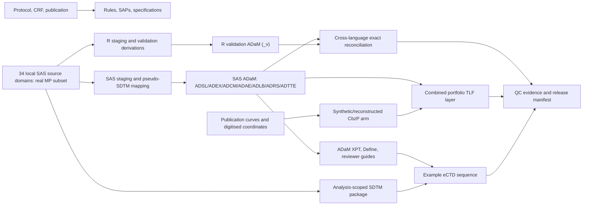

# TROPIC END-TO-END CONTEXT AUDIT

> **Historical forensic baseline — superseded for current-state decisions.** This
> report records the read-only repository state found on 2026-08-09 before the
> user-authorized remediation. Its detailed findings are intentionally preserved
> as the audit trail. Current implementation, validation evidence, dispositions,
> and readiness verdict are in
> [`TROPIC_PIPELINE_AUDIT_CLOSURE_2026-08-10.md`](TROPIC_PIPELINE_AUDIT_CLOSURE_2026-08-10.md).
> Do not use the baseline's 34-stage counts or unresolved technical findings as a
> description of the remediated working tree.

- **Audit date:** 2026-08-09
- **Repository:** `/Users/apple/Desktop/TROPIC`
- **Audited branch:** `codex/pipeline-audit-closure-2026-08-05`
- **Audited HEAD:** `f704b7a721b5c0723e7356addfada7b3cd44ad67` (`chore(release): refresh candidate checklist timestamp`, 2026-08-05)
- **Audit mode:** read-only forensic review. No production program, dataset, metadata artifact, submission package, or governance record was edited or regenerated. This report is the sole repository addition.

This audit applies the following evidence order whenever artifacts disagree: source data and raw records; executable code; generated datasets and outputs; execution logs; QC/reconciliation evidence; specifications; TLFs; regulatory documents; and finally README/commentary material. A lower-ranked claim is not treated as proof when higher-ranked evidence contradicts it.

Status terms used throughout are deliberately narrow:

- **IMPLEMENTED AND VERIFIED** — executable implementation exists, current evidence shows it ran, and a relevant check passed. This does not automatically establish scientific truth or regulatory validation.
- **IMPLEMENTED BUT NOT VERIFIED** — executable implementation exists, but current execution or adequate independent verification cannot be established.
- **DOCUMENTED/CLAIMED BUT NOT IMPLEMENTED** — prose or metadata claims a capability that is absent from executable/current artifacts.
- **PLANNED** — explicitly future or deferred work.
- **UNKNOWN/CANNOT ESTABLISH** — evidence is insufficient or irreconcilable.
- **BLOCKED/NO-GO** — a condition prevents the claimed submission or release state.

The term **exact parity** means equality under the repository's implemented comparison algorithm. It does not mean that the shared business rule, source interpretation, estimand, or regulatory framing is correct.

## 1. Executive Summary

### Overall verdict

**The repository is a substantial, unusually transparent portfolio-grade reconstruction and a credible engineering demonstration, but it is not ready for regulatory submission, sponsor handoff, or a claim of validated pivotal-trial reproduction. Submission status is BLOCKED/NO-GO.**

The strongest evidence is a genuine 34-stage hosted SAS/R pipeline run dated 2026-08-05, exact SAS-versus-R row/column reconciliation for eight analysis products, endpoint-level reconciliation, reproducibility controls, reviewer guides, Define-XML generation, and a structurally coherent example eCTD surface. Those are meaningful achievements. They demonstrate that the implemented code paths can agree with one another and that a defined example package can be assembled.

The decisive limitations are not cosmetic:

1. The only local patient-level trial data are 371 treated subjects from the mitoxantrone-prednisone comparator arm. The original TROPIC randomized ITT population contained 755 subjects across both arms. The cabazitaxel arm in this repository is reconstructed/synthetic and therefore cannot support confirmatory efficacy, safety, or submission claims.
2. The SAS configuration assigns the read-only source library and writable staging library to the same physical source directory. The staging program writes widened domain tables under original domain names. This violates the asserted immutable-source boundary and creates a direct source-overwrite risk.
3. The response/TTE spine mixes lesion-derived RECIST rows with generic disposition progression and death milestones under `OVRLRESP`. That contamination propagates into `BESTRESP`, `TTUMOR`, and potentially PFS event selection. The reviewer guides describe TTUMOR as RECIST-only, which executable and physical evidence do not support.
4. Several derivations materially diverge from protocol/SAP intent: AE week-to-date mapping is shifted by seven days relative to the stated convention; pain progression uses baseline rather than nadir; pain response uses a strict `>50%` threshold; treatment history can support pain progression even when it predates the trigger; exposure metrics are mislabeled; death/last-alive derivations ignore stronger available evidence; and analysis windows silently floor invalid chronology.
5. The current working tree is materially changed after the last sealed release candidate. The read-only release verifier currently reports **32/36 PASS**, failing source-tree match, clean-worktree, source-hash, and artifact-hash gates. The prior 2026-08-05 seal cannot authenticate the present 2026-08-09 state.
6. Metadata, guides, narrative reporting, QC registers, and executable behavior contain material contradictions. Examples include false claims that TTUMOR is RECIST-only, that all AE weeks use `(week-1)*7`, that source data cannot be modified, that SUBJID was removed from all non-DM SDTM domains, and that exposure summaries represent actual/planned dose intensity and completed cycles.
7. Commercial Pinnacle 21 ADaM execution is explicitly blocked by vendor-license expiry, published CDISC CORE coverage is partial, the SAP is unsigned, the workflow is single-author/portfolio-scoped, and Part 11, independent organizational QC, validated infrastructure, traceable approvals, adjudication, and sponsor-controlled source systems are not established.

### Current disposition by layer

| Layer | Evidence-backed disposition |
|---|---|
| Source ingestion/profile | Implemented and profiled; immutability control is defective |
| SAS production ADaM | Implemented and executed on hosted SAS; several material semantic defects remain |
| R validation ADaM | Implemented and executed; exact parity shown, but independence is partial and shared-rule errors survive |
| TTE reconciliation | Exact for implemented outputs; does not validate estimands against protocol truth |
| Synthetic cabazitaxel arm | Implemented as an explicitly synthetic benchmark; unsuitable for confirmatory inference |
| TLF production | Partial controlled catalog implemented; full SAP output package and listings are not built |
| Metadata/Define | Broadly implemented and structurally checked; semantic traceability is incomplete/inconsistent |
| Reviewer guides | Substantive and candid overall; contain several material false or stale statements |
| SDTM/ADaM conformance | Local/partial checks pass; full commercial and published-rule coverage is not established |
| Example eCTD surface | Current local validator passes; current contents are not authenticated by the prior seal |
| Reproducible release | Historical run reproducible in evidence; current worktree is unsealed and hash gates fail |
| Regulatory submission readiness | **BLOCKED/NO-GO** |

### Most important immediate decisions

- Treat this repository as a **portfolio demonstration / methods reconstruction**, not a submission deliverable.
- Quarantine and re-establish an immutable source boundary before any rerun.
- Correct and independently adjudicate the endpoint spine before trusting tumor response, TTUMOR, PFS, or downstream TLFs.
- Reconcile code, specifications, Define-XML, reviewer guides, narrative report, and QC registers from one controlled semantic source.
- Do not reseal until the working tree is intentional, all 36 release checks pass, source/artifact hashes are current, and a fresh end-to-end run is completed on a clean controlled state.

## 2. Study Context

TROPIC (Sanofi-Aventis protocol EFC6193; ClinicalTrials.gov NCT00417079) was a Phase III, randomized, open-label trial in metastatic hormone-refractory/castration-resistant prostate cancer after docetaxel. Protocol Amendment 5 was approved 21-Jul-2008. The planned comparison was:

- cabazitaxel 25 mg/m² intravenously every three weeks plus prednisone/prednisolone 10 mg daily (`CbzP`); versus
- mitoxantrone 12 mg/m² intravenously every three weeks plus prednisone/prednisolone 10 mg daily (`MP`).

The protocol targeted approximately 720 randomized subjects, 360 per arm, with the primary analysis after 511 deaths and approximately 90% power for a hazard ratio of 0.75. Overall survival was primary. Secondary endpoints included composite progression-free survival, tumor response/progression, PSA response/progression, pain response/progression, safety, and pharmacokinetics.

The pivotal publication reports 755 randomized ITT subjects (378 CbzP and 377 MP), 371 treated subjects in each safety arm, and a data cutoff of 25-Sep-2009. Reported OS medians were 15.1 versus 12.7 months, HR 0.70 (95% CI 0.59–0.83), with `p<0.0001`; PFS medians were 2.8 versus 1.4 months, HR 0.74 (95% CI 0.64–0.86). The publication reports 513 randomized deaths (234 CbzP, 279 MP), while safety-population death counts were 227 and 275. These population distinctions matter when benchmarking repository counts.

The available protocol and CRF support the following clinically material rules:

- OS is randomization to death; survivors are censored at the earlier of last known alive and cutoff.
- PFS is a composite of disease, tumor, PSA, pain progression, or death under protocol-specific timing and censoring rules.
- Pain response requires baseline PPI at least 2 and/or analgesic score at least 10, a PPI reduction of at least 2 or analgesic-score reduction of at least 50%, and confirmation at two visits separated by at least three weeks.
- Pain progression includes a PPI increase of at least 1 from the **nadir** on two visits, an analgesic-score increase of at least 25% from baseline, or palliative radiotherapy, with cancer-related clinical support and diary adequacy.
- The CRF includes AE/SAE collection, ECOG, lesion assessments, and seven-day pain diaries, confirming that these were intended collected concepts even where the local extracts are incomplete.
- Safety treatment-emergence is anchored from first dose through 30 days after the last cycle, using CTCAE v3.0 and MedDRA.

Two source-text ambiguities require controlled interpretation rather than silent choice. The protocol contains a pain-baseline inconsistency (`AS≥0` in one location versus `AS≥10` elsewhere), and the published PSA-response correction removes the protocol's absolute five-unit response floor. The repository generally applies the published PSA correction, but its pain logic has additional deviations described later.

Primary documentary evidence is in `01_source_data/Sanofi Study Protocol Tropic.pdf`, `01_source_data/Sanofi CRF Tropic.pdf`, and `01_source_data/reference_literature/de_bono_lancet_2010.pdf`. These are higher-authority study references than repository summaries, but neither their presence nor a reconstructed implementation establishes access to sponsor-controlled raw data, adjudication records, or the full trial database.

## 3. Project Objective

The evidence-backed project objective is to reconstruct a regulated-looking, end-to-end clinical reporting pipeline around the publicly documented TROPIC trial while explicitly distinguishing:

- real local patient-level MP-arm data;
- an independently reconstructed/synthetic CbzP comparator arm;
- SAS production implementations;
- R validation implementations;
- generated analysis datasets, TLFs, metadata, reviewer guides, and an example eCTD surface; and
- portfolio evidence from actual execution, reconciliation, and release gates.

`docs/PRODUCT_CLAIM.md` is the most reliable current boundary statement. It describes Path A as a portfolio/methods artifact and prohibits claims that the package is submission-ready, contains complete original IPD, is fully GxP validated, or meets Part 11/Pinnacle 21 certification. That boundary is consistent with the source facts and should govern all external representation.

The repository also contains a later controlled-draft SAP, `02_specifications/sap/TROPIC_SAP_v4.0_industry_grade.docx`, which clearly separates real MP data from the synthetic CbzP arm. It is dated 2026-06-25 and is unsigned/not sponsor-approved. It is therefore design authority for future implementation only to the extent deliberately adopted; it is not proof of historical protocol execution or sponsor approval. The older v3 SAP is explicitly portfolio-forensic, retains unresolved `[Programmer Name]` and `[Date of audit]` placeholders, and includes superseded descriptions.

The practical objectives that are actually met are narrower:

1. demonstrate multi-language clinical data engineering;
2. expose derivation and provenance artifacts;
3. compare SAS and R implementations;
4. benchmark a synthetic comparator against publication-level summaries;
5. generate example regulatory-style metadata and package surfaces; and
6. document limitations honestly enough for a reviewer to separate demonstration evidence from regulated evidence.

The project does **not** possess the evidentiary inputs required to recreate the original sponsor submission or independently validate the published pivotal result.

## 4. Repository Architecture

### Top-level organization

| Area | Primary role | Audit interpretation |
|---|---|---|
| `01_source_data/` | Protocol, CRF, publication, local SDTM/SAS data | Highest-value local evidence; only real MP treated subset |
| `02_specifications/` | SAP versions and specifications | Design intent; not all content is current or implemented |
| `03_metadata/` | ADaM workbook, Define-XML, controlled metadata | Generated/control layer; semantic gaps remain |
| `04_analysis_datasets/` | SAS/R programs and produced ADaM | Main executable and physical analysis layer |
| `05_outputs/` | TLF generation and outputs | Partial controlled output suite |
| `06_qc_evidence/` | Reconciliation, logs, audits, run evidence | Strong execution evidence, but mixed dates and scopes |
| `07_regulatory/` | SDRG/ADRG/BDRG, example package/eCTD | Regulatory-style surface, not a sponsor submission |
| `config/` | Machine-readable study configuration | Intended configuration authority; not uniformly consumed |
| `docs/` | claims, plans, traceability, governance | Important policy context; some stale/contradictory claims |
| `platform/` | orchestration, package, validation, release tooling | 34-stage pipeline and release controls |
| `tests/` | Python, R, and SAS tests | Useful automated coverage; two tests are outside CI invocation |
| `.github/workflows/` | CI definition | Static/test/release verification, not full patient-data rerun |

The current Git state is not a pristine release candidate. HEAD is not tagged, and the worktree contains 37 tracked modifications/deletions plus five untracked files before this report. Material changes include CI, governance documents, SAS labeling logic, Pinnacle 21 records, reviewer guides, package scripts, release verification, eCTD files, and dependency pins. The untracked files include three XML stylesheets, `platform/validate_ectd_sequence.py`, and `tests/test_submission_surface.py`. This audit does not infer that those changes are wrong; it establishes that they are outside the last authenticated manifest.

The architecture is best understood as four overlapping products rather than one homogeneous submission:

1. a real MP-arm analysis pipeline;
2. a synthetic/reconstructed CbzP benchmark pipeline;
3. a combined portfolio TLF layer; and
4. a regulatory-style packaging and evidence layer.

Some documents blur these boundaries. The most trustworthy files (`docs/PRODUCT_CLAIM.md`, the reviewer-guide disclaimers, and release notes) preserve them, while selected Define context attributes, guides, and report language imply a stronger submission posture than the evidence allows.

## 5. Source Data Inventory

### Patient-level source domains

`platform/source_profile/domain_inventory.csv` records 34 SAS datasets, 458,333 total records, and source metadata identified as SDTMIG 3.1.1 / Define-XML 1.0. The source Define contains 34 `ItemGroupDef` elements. The physical inventory is:

Every file is a SAS dataset under `01_source_data/real_sdtm/<lowercase-domain>.sas7bdat`. The inventory keys were profile-derived and have zero duplicate-key records under the listed definitions.

| Domain/file | Rows | Vars | Subjects | Profile key | Primary purpose / useful evidence |
|---|---:|---:|---:|---|---|
| `ae.sas7bdat` | 5,428 | 29 | 357 | USUBJID+AESEQ | adverse events; week-precision start/end |
| `cd.sas7bdat` | 3,339 | 14 | 371 | USUBJID+CDSEQ | clinical disease/assessment detail |
| `cm.sas7bdat` | 24,534 | 18 | 371 | USUBJID+CMSEQ | concomitant medication, subsequent therapy, G-CSF |
| `cx.sas7bdat` | 2,516 | 21 | 371 | USUBJID+CXSEQ | cancer/history-related records |
| `dm.sas7bdat` | 371 | 12 | 371 | USUBJID | subject identity, sex/race, reference dates, planned MP arm |
| `ds.sas7bdat` | 2,842 | 14 | 371 | USUBJID+DSSEQ | randomization, progression, alive/death disposition by week |
| `eg.sas7bdat` | 558 | 15 | 352 | USUBJID+EGSEQ | ECG assessments |
| `ex.sas7bdat` | 3,485 | 16 | 371 | USUBJID+EXSEQ | mitoxantrone/prednisone/prednisolone and one XRP6258 exposure |
| `ie.sas7bdat` | 42 | 13 | 38 | USUBJID+IESEQ | inclusion/exclusion exceptions |
| `lb.sas7bdat` | 80,788 | 27 | 371 | USUBJID+LBSEQ | 24 laboratory tests, dated values/toxicity grades |
| `ls.sas7bdat` | 5,774 | 21 | 371 | USUBJID+LSSEQ | lesion/tumor assessment inputs |
| `mh.sas7bdat` | 2,292 | 13 | 346 | USUBJID+MHSEQ | medical history |
| `pe.sas7bdat` | 3,614 | 17 | 371 | USUBJID+PESEQ | physical examination |
| `pn.sas7bdat` | 26,982 | 18 | 358 | USUBJID+PNSEQ | paired pain-intensity and analgesic-score diaries/visits |
| `pr.sas7bdat` | 151 | 10 | 65 | USUBJID+PRSEQ | procedures, including radiotherapy support |
| `sc.sas7bdat` | 11 | 11 | 11 | USUBJID+SCSEQ | subject characteristics |
| `suppae.sas7bdat` | 53,153 | 11 | 357 | USUBJID+RDOMAIN+QNAM+IDVARVAL | AE qualifiers, including TRTEM and exact death dates |
| `suppcm.sas7bdat` | 108,333 | 11 | 371 | USUBJID+RDOMAIN+QNAM+IDVARVAL | medication qualifiers, including progression dates |
| `suppdm.sas7bdat` | 2,597 | 11 | 371 | USUBJID+RDOMAIN+QNAM+IDVARVAL | ITT/PPROT/SAFETY flags and actual arm |
| `suppds.sas7bdat` | 1,083 | 11 | 338 | USUBJID+RDOMAIN+QNAM+IDVARVAL | disposition qualifiers |
| `suppeg.sas7bdat` | 164 | 11 | 118 | USUBJID+RDOMAIN+QNAM+IDVARVAL | ECG qualifiers |
| `suppex.sas7bdat` | 18,137 | 11 | 371 | USUBJID+RDOMAIN+QNAM+IDVARVAL | exposure qualifiers/interruption information |
| `suppie.sas7bdat` | 21 | 11 | 21 | USUBJID+RDOMAIN+QNAM+IDVARVAL | eligibility qualifiers |
| `supplb.sas7bdat` | 80,788 | 11 | 371 | USUBJID+RDOMAIN+QNAM+IDVARVAL | laboratory qualifiers |
| `suppls.sas7bdat` | 5,610 | 11 | 367 | USUBJID+RDOMAIN+QNAM+IDVARVAL | lesion qualifiers |
| `suppmh.sas7bdat` | 2,025 | 11 | 326 | USUBJID+RDOMAIN+QNAM+IDVARVAL | medical-history qualifiers |
| `supppe.sas7bdat` | 1,134 | 11 | 368 | USUBJID+RDOMAIN+QNAM+IDVARVAL | physical-exam qualifiers |
| `supppr.sas7bdat` | 151 | 11 | 65 | USUBJID+RDOMAIN+QNAM+IDVARVAL | procedure qualifiers |
| `sv.sas7bdat` | 3,930 | 9 | 371 | USUBJID+VISITNUM | subject visits and dated contact structure |
| `te.sas7bdat` | 4 | 6 | — | STUDYID+ETCD | trial elements |
| `ti.sas7bdat` | 48 | 5 | — | STUDYID+IETESTCD | trial inclusion/exclusion criteria |
| `ts.sas7bdat` | 16 | 6 | — | STUDYID+TSPARMCD | trial summary parameters |
| `tv.sas7bdat` | 24 | 7 | — | STUDYID+ARMCD+VISITNUM | trial visits by arm |
| `vs.sas7bdat` | 18,388 | 19 | 371 | USUBJID+VSSEQ | vital signs with dates/study days |

### Population identity and completeness

All 371 DM records have planned `ARM=MP` / `ARMCD=A`; all subjects are male. Race distribution is 308 White, 32 Asian, 20 Black, and 11 Other. `AGE` is absent and the source `AGEGRP` field carries apparent individual ages plus a `>=85` value. Reference start dates range from 03-Jan-2007 to 24-Oct-2008.

SUPPDM marks all 371 records ITT, per-protocol, and safety `Y`, and records actual arm `MP` for 370 subjects and `XRP6258` for one subject. EX confirms the anomaly: subject `006193-530-002-603` has ten XRP6258 infusions plus prednisone, while ADSL later forces MP from DM. The exposure inventory includes 1,731 mitoxantrone, 1,241 prednisone, 503 prednisolone, and 10 XRP6258 records. This is a concrete treatment-assignment discrepancy requiring adjudication; it is not resolved by exact SAS/R parity.

The source is temporally lossy. AE records generally carry study-week offsets rather than exact dates; 26 AE start weeks are missing, and many AE end weeks are missing. DS similarly uses week offsets. SUPPAE contains 25 exact `AEDTHDTC` values across 23 subjects. Only two exactly match the ADSL death dates reconstructed from DS weeks; for the remainder ADSL is one to six days earlier, median two days earlier. Stronger exact death evidence therefore exists but is not used.

Other relevant coverage includes:

- DS dispositions with 266 DEATH records and 155 DEAD-status records, alongside progression milestones and alive contacts;
- 24 laboratory test types with dates generally present;
- paired pain-intensity and analgesic-score records across visits, but only 358 subjects represented;
- PR radiotherapy records and CM post-treatment antineoplastic records;
- 1,638 `CMPRGDTC` supplemental dates; and
- AE treatment-emergence qualifiers for all 5,428 AE records.

### Suitability finding

The local source is sufficient to demonstrate a treated-MP-arm derivation pipeline and some within-arm safety/efficacy summaries. It is insufficient for the original randomized two-arm ITT analysis, original cabazitaxel safety analysis, validated publication reproduction, complete BIMO/site reconstruction, or an actual regulatory submission. Missing precision and structural gaps force assumptions that must remain visible.

## 6. End-to-End Data Flow

The observed pipeline is a hybrid of local source artifacts, hosted SAS execution, local/hosted R validation, synthetic-comparator reconstruction, metadata generation, and package assembly:

The latest documented full run contains 34 ordered stages:

1. environment preflight (`G00`);
2. source/manifest preflight (`G02`);
3. ADaM labels;
4. R staging;
5. R SDTM validation;
6–13. R ADSL, ADEX, ADCM, ADAE, ADLB, ADRS, ADTTE, and BIMO;
14. hosted SAS production run;
15. cross-language audit;
16–18. admiral ADSL, OS, and PFS checks;
19. synthetic CbzP bridge;
20. TFL generation;
21. results reconciliation;
22. forest-plot validation;
23. figure-data reconciliation;
24. specification-to-Define checks;
25. specification-to-data checks;
26. governance/QC gate (`G07`);
27. Dataset-JSON generation;
28. Analysis Results Standard generation;
29. USDM generation;
30. submission-package assembly;
31. evidence-backbone update;
32. artifact materialization;
33. log-cleanliness gate; and
34. release-manifest construction/verification.

`platform/pipeline_health.json` records this run as `GREEN`, `ODA`, `full_dag`, with 34/34 stages and no not-run stage at `2026-08-05T08:11:51Z`. SAS is identified as 9.04.01M8P022223 and R as 4.6.0. A later governance-only reseal did not repeat the clinical computation. Consequently, the 34-stage evidence is authentic historical execution evidence but not proof that the current dirty successor state has run end-to-end.

The data-flow boundary that most needs correction is in `04_analysis_datasets/programs/sas/00_config.sas:68-69`: `REALSDTM` and `STAGING` resolve to the same physical `01_source_data/real_sdtm` directory, while `04_analysis_datasets/programs/sas/L_staging_ingest.sas:50-107` writes `staging.<domain>`. The intended `STAGING_PATH` in `config/study_config.yaml:62` names a separate staging subdirectory but is not honored by this SAS assignment. This is both a design and provenance failure.

## 7. SAS Production Architecture

`04_analysis_datasets/programs/sas/00_master_driver.sas:20-65` defines the production order: configuration, staging, pseudo-SDTM mapping, ADSL, ADEX, ADCM, ADAE, ADLB, ADRS, ADTTE, BIMO, and XPT export. This is a recognizable dependency order, and the hosted SAS log plus physical outputs show the major programs executed.

### Inputs, transformations, outputs, and checks

| Program/layer | Inputs | Principal transformation | Output | Current check |
|---|---|---|---|---|
| `L_staging_ingest.sas` | real source SAS tables | widens/normalizes source for downstream code | staging domains | run log and downstream availability |
| `S_sdtm_mapping.sas` | staging domains | pseudo-SDTM date and RS construction | working SDTM-like tables | R/SAS output parity downstream |
| `A_adsl_generation.sas` | DM/EX/DS/PN/SUPPDM | subject dates, arms, flags, baselines | ADSL 371×42 | exact R parity; limited semantic tests |
| `A_adex_generation.sas` | EX/ADSL | exposure detail and summary parameters | ADEX 13,052×14 | exact R parity |
| `A_adcm_generation.sas` | CM/ADSL | medication flags and categories | ADCM 24,534×15 | exact R parity |
| ADAE programs | AE/SUPPAE/ADSL | dates, TEAE, episodes, analysis flags | ADAE 5,428×29 | exact R parity; selected tests |
| `A_adlb_generation.sas` | LB/ADSL | baseline, windows, toxicity parameters | ADLB 78,619×27 | exact R parity; lab-shift test |
| `A_adrs_generation.sas` | lesion/DS/PSA/bone data | response spine and best response | ADRS 3,275×13 | exact R parity; inadequate semantic isolation |
| `A_adtte_generation.sas` | ADSL/ADAE/ADRS/CM/pain | six time-to-event parameters | ADTTE 2,226×19 | exact R/admiral/summary checks |
| BIMO program | ADSL/site-derived data | reduced investigator-site surface | CLINSITE 69×10 | structural/package checks |

### Architectural strengths

- The master driver makes ordering explicit.
- The hosted run records a real SAS runtime rather than relabeling an R output as SAS.
- Production and validation XPT files are byte-distinct but logically reconciled.
- Key programs expose rule logic in reviewable code.
- Abort-scope and run-status checks exist.

### Architectural defects

The source/staging alias is the highest-risk architectural defect. A writable libref should never share the physical path of the asserted read-only source. The run log confirms both aliases and shows widened outputs. Local source mtimes may remain historical because the latest run was remote, but that does not neutralize the design flaw: a future run can overwrite the resident source view, and a remote run may have already staged onto its uploaded source copy.

Other cross-cutting issues include:

- `S_sdtm_mapping.sas:124-135` maps AE dates as `RFSTDTC + AESTWK*7`, while DS uses `(DSSTWK-1)*7` at lines 202-227. Documentation claims a single `(week-1)*7` convention. AE is therefore shifted seven days relative to the documented rule.
- `S_sdtm_mapping.sas:257-288` constructs response records from generic DS progression/death milestones, which later collide with lesion-derived response semantics.
- Several programs use convenient defaults or floor dates instead of creating explicit unresolved-data findings.
- Machine-readable configuration is not consistently the runtime authority, allowing documentation/configuration/program divergence.

SAS production is **IMPLEMENTED AND EXECUTED**, but the scientifically material defects prevent a status of validated or submission-ready.

## 8. R Validation Architecture

The R path independently reads staged/source data and constructs `_v` validation datasets rather than reading SAS production ADaM. This is materially better than a superficial comparison script. Current physical products are:

| Dataset | Production and validation shape |
|---|---:|
| ADSL | 371×42 |
| ADEX | 13,052×14 |
| ADCM | 24,534×15 |
| ADAE | 5,428×29 |
| ADLB | 78,619×27 |
| ADRS | 3,275×13 |
| ADTTE | 2,226×19 |
| CLINSITE | 69×10 |

All eight production/validation pairs reconcile logically under the repository comparator. Their binary hashes are distinct, supporting separate serialization/provenance.

The runtime evidence identifies R 4.6.0. `renv.lock` contains 111 packages, including renv 1.2.3, haven 2.5.5, dplyr 1.2.1, survival 3.8-6, IPDfromKM 0.1.10, diffdf 1.1.2, admiral 1.5.0, and ggplot2 4.0.3. The read-only lock check passes, with a note that `logrx` is not present. `requirements-ci.lock` uses explicit versions but no cryptographic package hashes; it has also changed since the last sealed manifest.

The validation programs are separate implementations in another language and generally build from source/staging plus prior `_v` domains. The R TLF layer reads validation `_v` products. This supports implementation independence at the language/code-path level. It does not establish:

- independent requirements interpretation;
- independent programmer authorship;
- separate organizational review;
- independent medical/statistical adjudication;
- independent source extraction; or
- freedom from shared specifications and shared upstream transformations.

The admiral checks for ADSL, OS, and PFS add useful framework diversity. They reconcile 371 subjects for ADSL and 371 records each for OS/PFS, but they consume substantially the same event anchors and implemented rules. They are a secondary implementation check, not an independent estimand validation.

## 9. Independent Double-Programming Assessment

The repository should describe its approach as **partial technical double programming**, not fully independent GxP double programming.

| Independence dimension | Evidence | Classification |
|---|---|---|
| Different language/runtime | SAS 9.4 production and R 4.6 validation | Implemented and verified |
| Separate executable programs | SAS and R derivations exist and create distinct files | Implemented and verified |
| Separate input path | Both ultimately use the same source/staging concepts | Partial |
| Separate intermediate data | SAS and `_v` analysis chains are distinct | Implemented and verified |
| Independent specifications | Both implement common repository rules/specifications | Not established |
| Independent programmer | Repository/governance indicates a single-author portfolio context | Not established |
| Independent statistical interpretation | Shared endpoint decisions and shared defects are present | Not established |
| Independent medical adjudication | No adjudication workflow/evidence found | Not built |
| Blinded reconciliation governance | Reconciliation exists; independent sign-off/blinding not evidenced | Not established |
| Organizational validation/SOP control | No sponsor/CRO validated quality system is evidenced | Not established |

`06_qc_evidence/audit/cross_lang_audit.R:51-160` performs a serious comparator: column symmetry, normalized character missingness, manifest-defined keys, sorting by keys plus all columns, within-tie sequencing, and `diffdf` content comparison. It does not apply a general numerical tolerance at the cell level. The current log reports all eight domains passing with zero cell differences and exact 43-subject F042 endpoint parity.

This is strong evidence that two implementations produce the same represented data. It is weak evidence against a shared semantic error. The ADRS progression contamination, exposure-summary semantics, pain-rule deviations, and date conventions are examples where SAS and R can agree exactly and both be wrong relative to protocol intent.

## 10. ADSL

### Physical result and principal logic

The current production and validation ADSL files each contain 371 records and 42 variables, with one record per local subject. `04_analysis_datasets/programs/sas/A_adsl_generation.sas` derives:

- first and last exposure dates from EX at lines 32-43;
- death date from the first approximate DS death record at lines 45-70;
- last-known-alive date from the maximum DS-derived date only at lines 72-81;
- a pain baseline from pre-dose PN at lines 107-149;
- randomized/planned treatment from DM at lines 224-245;
- population flags inherited from supplemental source at lines 252-254; and
- default baseline covariates at lines 261-279.

### Findings

1. **Treatment assignment is not reconciled.** ADSL uses DM and assigns all 371 subjects to MP even though SUPPDM and EX identify one subject with actual XRP6258 exposure. A controlled rule may reasonably preserve randomized treatment for an ITT variable while separately deriving actual treatment, but this ADSL does not surface the anomaly sufficiently. Any treatment-emergent/safety use of the same arm field is especially problematic.
2. **Death-date hierarchy is suboptimal.** Exact `AEDTHDTC` values exist in SUPPAE for 23 subjects, but ADSL uses approximate DS weeks. Only two of 25 exact death records match reconstructed ADSL dates; the others differ by one to six days. The chosen evidence is lower precision than an available source.
3. **Last-known-alive is incomplete.** `LSTALVDT` is the maximum DS date, not the maximum trustworthy contact/assessment across DS, visits, labs, exposure, response, and other domains as metadata/documentation claim. This can change censoring.
4. **Pain baseline is not the protocol diary construct.** The generic ADSL implementation pools pre-dose PN values and takes medians for both PPI and analgesic score. Protocol/F042 logic requires a seven-day window, adequate diary-day counts, PPI median, and analgesic-score mean.
5. **Defaults masquerade as subject covariates.** ECOG is defaulted to 1, PSA to 110, alkaline phosphatase to 140, and hemoglobin to 11.5 where unavailable; albumin and LDH remain missing despite configuration values. These constants are acceptable only as openly synthetic analysis scaffolding, not as collected baseline data or a basis for inferential subgroup claims.
6. **Population labels overstate the local extract.** All records inherit ITT/PPROT/SAFETY `Y`, but the file represents the 371 treated MP subset, not the 377 randomized MP ITT population and not the full 755-subject randomized trial. The source flag names retain historical meaning that the local extraction cannot independently prove.

### Disposition

ADSL is **IMPLEMENTED AND TECHNICALLY RECONCILED**, but its treatment, death, last-alive, pain-baseline, population, and default-covariate semantics are **not scientifically verified**. It is suitable for the explicitly limited portfolio path only after those limitations remain visible in every consumer.

## 11. ADAE

The current ADAE contains 5,428 records, 29 variables, and 357 subjects. There are 3,921 treatment-emergent records across 328 subjects under the implemented flag. The input mapping reconstructs AE dates from study weeks, and the analysis layer applies supplemental qualifiers, treatment emergence, categorization, and episode logic.

### Date and treatment-emergence logic

The upstream AE start mapping at `04_analysis_datasets/programs/sas/S_sdtm_mapping.sas:124-135` adds `AESTWK*7` to the reference date. The DS convention uses `(week-1)*7`. The traceability documents state the latter convention generally. This means every nonmissing mapped AE week is seven days later than the documented convention. Because temporal flags and treatment windows depend on those dates, the discrepancy is analytically material.

`TRTEMFL` primarily trusts the source `AETRTEM` supplemental qualifier. It is not independently rederived against the protocol's first-dose through 30-days-after-last-cycle interval. Physical review found one flagged TEAE occurring beyond `TRTEDT+30`, 26 records with missing analysis start dates, and 1,116 records with negative analysis study days. Trusting an upstream qualifier can be defensible, but then the output should label it as a carried source assessment and separately check chronology.

### Episode logic

`04_analysis_datasets/programs/sas/A_adae_io_respec.sas:90-164` groups events using a gap of at most three days. A physical edge case shows that the first row of an episode can retain a shorter `CIAEEDT` than the final episode end. The resulting episode-level variables are not fully propagated to every constituent row. This is a correctness defect if downstream summaries expect identical episode endpoints within an episode.

The baseline skeleton creates approximately 1,134 rows with blank seriousness, causality, and outcome fields. This can support denominators or zero-event structure, but it must be kept out of event-counting logic and clearly distinguished from collected AE observations.

### Safety meaning

Source seriousness is substantially retained, and 78 subjects contribute first serious TEAEs to TTSAE. However, the current implementation does not itself demonstrate:

- a protocol-complete 30-day treatment-emergence derivation;
- consistent use of exact versus reconstructed dates;
- full MedDRA dictionary/version traceability;
- CTCAE v3.0 grade derivation rather than source carriage;
- death/SAE reconciliation across AE, DS, and safety narratives; or
- medical review of conflicting records.

ADAE is **IMPLEMENTED AND EXACTLY RECONCILED ACROSS LANGUAGES**, but treatment-emergence and episode semantics are **PARTIALLY VERIFIED** and the date shift is a major upstream defect.

## 12. ADTTE

The current ADTTE has 2,226 records and 19 variables: exactly 371 records for each of six parameters.

| Parameter | Population | Events | Implemented median | Primary event source |
|---|---:|---:|---:|---|
| OS | 371 | 266 | 386 days / 12.68 months | DS-derived death |
| PFS | 371 | 322 | 43 days / 1.41 months | ADRS/pain/death composite |
| TTPAIN | 371 | 45 | Not reached | F042 pain progression |
| TTPSA | 371 | 265 | 68 days | PSA progression |
| TTSAE | 371 | 78 | Not reached | first serious TEAE |
| TTUMOR | 371 | 328 | 72 days | `OVRLRESP=PD` |

### General construction

`04_analysis_datasets/programs/sas/A_adtte_generation.sas` builds common event anchors and then six parameter-specific records. Twenty PFS and two TTPSA dates occur before the analysis origin and are silently floored to day 1. The log registers these as reviewed exceptions. A floor makes the table computable, but it destroys the observed chronology and should not substitute for data adjudication.

### PFS branch-order defect

The PFS implementation at lines 209-326 evaluates progression before death. If progression is present, it becomes the event unless prior post-treatment antineoplastic therapy causes censoring. Only if progression is absent does death become the event. This means a progression dated after death would win over death. No such physical case was found in the current file, so the defect is latent rather than currently count-changing; nevertheless, event selection should be minimum qualifying event by date with explicit tie rules, not precedence by branch existence.

Implemented PFS event descriptions are 299 disease progression, 12 pain progression, and 11 death. Censoring consists of 43 prior-new-therapy censors, five last-evaluation censors, and one no-postbaseline censor. Twenty-nine subjects with a death record are censored because post-treatment antineoplastic therapy precedes the later event under the current rule. Whether that rule matches the target estimand must be explicitly justified; the current report should not imply a universal protocol truth.

### Parameter-specific defects

- **TTUMOR:** constructed from `OVRLRESP=PD` at lines 452-528. Because `OVRLRESP` contains generic DS progression rows, this is not RECIST-only. Its 328 events cannot be interpreted as 328 lesion-defined tumor progressions.
- **TTPSA:** uses the last available PSA assessment as a censor anchor; where only pre-randomization PSA exists, chronology can be floored to day 1 rather than flagged unresolved.
- **TTSAE:** censoring uses DS-derived `LSTALVDT`/cutoff rather than a safety-specific observation end, last safety contact, or the protocol AE collection window.
- **TTPAIN:** consumes the controlled F042 output, but that module retains protocol deviations described in Section 17.
- **OS:** internally coherent under its chosen approximate dates, but does not use exact death evidence or a comprehensive last-alive hierarchy.

### Verification meaning

SAS/R dataset parity, endpoint-summary parity, and admiral OS/PFS comparison all pass. Those checks establish repeatability of the implemented rules. They do not resolve the shared source hierarchy, progression contamination, censoring interpretation, or date-flooring defects. ADTTE is **IMPLEMENTED AND TECHNICALLY RECONCILED**, but only OS is close to a stable endpoint implementation, and even OS remains precision-limited.

## 13. Other ADaM

### ADEX

ADEX contains 13,052 records and 14 variables. `04_analysis_datasets/programs/sas/A_adex_generation.sas:27-38` defines `NCYCLE` as maximum `EXSEQ` across all exposure records and `RDI` as maximum `EXTRINT`. It then emits `PERFDOSE`, `ADJ`, and `ADJAE` parameters for every EX row at lines 59-196. Each parameter has 3,485 rows; 1,746 `PERFDOSE` values are missing because daily oral exposure records do not have the assumed infusion-dose field.

These variables do not have the meanings claimed in the analysis report and metadata:

- `RDI` is not actual cumulative dose divided by planned cumulative dose;
- `NCYCLE` is not a reliable completed-cycle count when `EXSEQ` spans oral and infusion records; and
- the TLF label `ALL CYCLES` does not repair the semantic mismatch.

The current NCYCLE median is 8 and maximum 20, but those numbers should not be reported as completed cycles without a corrected cycle algorithm. ADEX is technically reconciled but **scientifically mislabeled**.

### ADCM

ADCM contains 24,534 records and 15 variables. `04_analysis_datasets/programs/sas/A_adcm_generation.sas:26-105` carries concomitant medications, identifies post-treatment antineoplastic therapy using the exact source category `POST TREATMENT ANTI-CANCER DRUG THERAPY`, flags prednisone/prednisolone, and identifies G-CSF using three exact drug names plus indication/timing rules.

The G-CSF timing window is around overall first dose (`CMSTDY -3` through `3`), not cycle-specific prophylaxis. This is materially narrower than a longitudinal G-CSF support analysis and inconsistent with some Optimus-facing descriptions. Post-treatment antineoplastic identification is important to PFS censoring and should be validated against all supplemental dates and category values. ADCM is **IMPLEMENTED AND RECONCILED**, with limited semantic validation.

### ADLB

ADLB contains 78,619 records and 27 variables. Major findings are:

- At `04_analysis_datasets/programs/sas/A_adlb_generation.sas:67-73`, missing `ADY` satisfies the SAS branch `ADY <= 0`, so 24 raw records with missing dates/day are classified into baseline. A missing guard is required before window assignment.
- `BASEFL=Y` is assigned to every record in the baseline window, producing 10,437 flagged rows compared with 7,720 unique subject-parameter baseline selections. Metadata describes a selected baseline record, so flag and description disagree.
- `ANL01FL` does select one record per subject/parameter/window, which partly limits downstream duplication.
- All non-PSA parameters are assigned `PARCAT1=HEMATOLOGY` at line 45, including chemistry analytes. The R code repeats this at `v_adlb_validation.R:49`.
- `ATOXGR` carries/parses source `LBTOXGR`; it is not independently derived from numeric values and CTCAE ranges as metadata imply.
- There are 1,158 missing analysis dates overall, including introduced/synthetic Optimus records; 24 are inherited raw records.
- Implemented windows are baseline, C1D1, C1D8, C1D15, C2D1, C2D8, and C3D1 only, not a full longitudinal laboratory analysis.

The SAS chained-range expressions used in toxicity logic are valid SAS interval syntax and should **not** be reported as a language bug. The actual issues are missing-date handling, category assignment, flag semantics, and metadata overstatement.

### ADRS

ADRS contains 3,275 records and 13 variables:

| PARAMCD | Rows | Salient values/results |
|---|---:|---|
| BESTRESP | 351 | PD 194, SD 117, PR 33, DEATH 7 |
| BSGRESP | 371 | confirmed 0, unconfirmed 5, none 366 |
| OBJRESP | 351 | 13 confirmed responders |
| OVRLRESP | 1,460 | PD 648, DEATH 421, SD 329, PR 62 |
| PSARESP | 371 | 69 responders |
| PSPROG | 371 | 265 progressors |

The central defect is in `04_analysis_datasets/programs/sas/A_adrs_generation.sas:153-193`. Lesion-derived RECIST response rows are assigned to `OVRLRESP`; then DS-derived progression and death records are mapped to the same parameter and parameter code. There are 697 rows in duplicated subject/date sets. `BESTRESP` at lines 199-238 consumes the combined spine, which explains the otherwise nonsensical DEATH category in a best-response parameter. `TTUMOR` later consumes `OVRLRESP=PD`, so generic DS disease progression is mislabeled as tumor progression.

OBJRESP confirmation is lesion-derived and yields 13 responders, but the code does not make an explicit intervening-PD exclusion evident. PSA response applies the publication correction—at least 50% confirmed decline without the old absolute-five floor—and yields 69 responders. PSA progression is labeled PCWG3 even though the trial predates PCWG3; this is a historical-method anachronism and should be labeled exploratory/reconstructed. Bone-scan response uses a later 2+2 convention and produces no confirmed responders; it too is exploratory.

ADRS is **IMPLEMENTED AND EXACTLY RECONCILED**, but the response-spine contamination is a **critical semantic defect** that invalidates strong interpretation of BESTRESP, OVRLRESP, TTUMOR, and any composite endpoint that consumes those rows.

### CLINSITE/BIMO

CLINSITE contains 69 records and 10 variables. It is not present in the seven-dataset ADaM specification or ADaM Define-XML. The BDRG correctly notes that it is a reduced demonstration rather than a full BIMO dataset: approximately 10 variables are present versus a fuller expected surface, principal-investigator values are placeholders such as `PI_<site>`, and country, deviation, financial-disclosure, and other operational source fields are unavailable. It is **IMPLEMENTED AS A DEMONSTRATION**, not submission-complete.

## 14. Subject Timeline Engine

There is no single canonical subject-timeline engine. Timeline construction is distributed across pseudo-SDTM mapping, ADSL, ADAE, ADRS, ADTTE, ADCM, and the F042 pain module. This distributed design allows incompatible date conventions and evidence hierarchies to coexist.

### Observed time rules

| Concept | Implemented source/rule | Concern |
|---|---|---|
| Randomization | DM reference/randomization date | Generally stable |
| AE start/end | reference date + `week*7` | Seven-day divergence from documented `(week-1)*7` |
| DS events/death | reference date + `(week-1)*7` | Approximate weekly interval represented as a point |
| Exact death | SUPPAE `AEDTHDTC` | Available but ignored by ADSL/OS |
| Last known alive | maximum DS date | Omits other credible dated contacts |
| Pain visits | PN dates/visits with F042 adequacy rules | Better controlled, but separate from general timeline |
| Post-treatment therapy | CM start/progression dates | Used for PFS censoring; source hierarchy needs adjudication |
| Invalid pre-origin event | floor to origin/day 1 | Preserves computability but hides chronology conflict |

A robust engine would preserve date precision, interval bounds, source provenance, conflict status, and endpoint-specific admissibility instead of collapsing approximate weeks to unqualified exact-looking dates. It would expose competing evidence—such as DS-derived versus SUPPAE death dates—rather than silently choosing one. It would also use a common minimum-event selector for composite endpoints and explicit tie-breaking.

Current status is **DOCUMENTED IN FRAGMENTS AND PARTIALLY IMPLEMENTED**, not a unified verified timeline engine.

## 15. OS Derivation

OS is the strongest implemented endpoint but remains constrained by source precision.

`04_analysis_datasets/programs/sas/A_adtte_generation.sas:96-123` uses the ITT-flagged local population, `RANDDT` as origin, `DTHDT` as event, and the minimum of `LSTALVDT` and cutoff as the censor date. The result is 371 subjects, 266 events, and a median of 386 days (12.68 months), close to the published MP median of 12.7 months.

### What is verified

- one OS record per local subject;
- exact SAS/R output parity;
- exact endpoint summary parity at N=371, events=266, median=386 days;
- an admiral implementation with the same 371-subject result surface; and
- consistency of the median with the publication's treated/local MP context.

### What is not verified

- that `DTHDT` uses the best source date; exact SUPPAE evidence is ignored;
- that `LSTALVDT` is a comprehensive last-known-alive date;
- that every inherited ITT flag has the same meaning as the original randomized ITT population;
- that cutoff/censoring rules reproduce the sponsor analysis database; and
- that event-count differences versus the published randomized MP count are fully reconciled.

The local 266 event count aligns with source DS death records, while the publication reports 279 MP randomized deaths and 275 treated/safety deaths. Those are different populations and possibly different evidence snapshots; they should not be presented as a failed reproduction without a formal population bridge, nor as a successful reproduction based only on the median.

OS is **IMPLEMENTED, RECONCILED, AND PLAUSIBLE WITHIN THE LOCAL SUBSET**, but not sponsor-validated.

## 16. PFS Derivation

PFS combines the earliest accepted tumor/disease, bone, PSA, pain, or death event, with pre-event post-treatment antineoplastic therapy used as a censoring intervention. The result is 322 events and a 43-day (1.41-month) median, close to the published MP median of 1.4 months.

### Event inputs

- `OVRLRESP=PD`, which includes both lesion PD and generic DS progression;
- confirmed bone progression (`BSGRESP`);
- PSA progression (`PSPROG`);
- F042 pain progression;
- death; and
- post-treatment antineoplastic therapy for censoring.

### Material risks

1. **Semantic contamination:** generic DS progression is treated within the same response spine as lesion PD. PFS may legitimately use disease progression broader than RECIST, but that broader source must be explicitly classified and deduplicated, not mislabeled `OVRLRESP`.
2. **Precedence before chronology:** progression existence is considered before death, creating a latent possibility that a later progression outranks an earlier death.
3. **Censoring ambiguity:** 43 subjects are censored for new therapy and 29 subjects with death records are censored because new therapy occurred first. This may reflect an estimand choice, but protocol/SAP traceability and sensitivity analysis are not adequate to establish it.
4. **Approximate and floored dates:** DS/AE weeks are point-imputed and 20 PFS pre-origin dates are set to day 1.
5. **Last-evaluation hierarchy:** the censor anchor pools response, PSA, and pain records without a documented precision/quality hierarchy comparable to a sponsor endpoint adjudication process.
6. **Shared implementation assumptions:** SAS, R, and admiral agreement is not independent confirmation of the event taxonomy.

PFS is **IMPLEMENTED AND TECHNICALLY RECONCILED**, but the current derivation is **NOT SCIENTIFICALLY VERIFIED**. The numerical match to a published median is a useful benchmark, not proof, especially because the same local data and broad progression milestones make a short MP median likely.

## 17. Other Efficacy Endpoints

### Controlled F042 pain derivation

The controlled pain implementation is in `04_analysis_datasets/programs/sas/F042_phase2_pain_derivation.sas` and `04_analysis_datasets/programs/r/f042_provisional_pain_derivation.R`. It is substantially more rigorous than the generic ADSL pain baseline. It applies a treatment-date-minus-six-days through treatment-date baseline window, requires five distinct diary days per component, uses median PPI and mean analgesic score, handles component discordance, requires a confirmation visit at least 21 days later, unions CM/PR radiotherapy evidence, and checks disease support.

Current physical summaries show:

- 45 primary pain-progression subjects;
- 45 diary-only progression subjects;
- one supportive radiotherapy-only subject;
- 15 complete radiotherapy inventory records plus one partial/missing record;
- 43 pain responders; and
- exact 43-subject SAS/R endpoint parity for the reconciled F042 output.

Four protocol deviations remain:

1. PPI progression uses an increase of at least one from **baseline**, not from the protocol-required **nadir** (`F042_phase2_pain_derivation.sas:284-295`; R lines 239-247).
2. Analgesic-score response requires a strict `>0.5` proportional reduction, excluding exactly 50%, rather than `>=50%` (`SAS:330-357`; R lines 581-587).
3. Disease support accepts any evidence whose latest possible date is on or before the confirming event (`SAS:608-617`; R lines 439-447), including evidence that may predate the initial trigger. This does not establish contemporaneous cancer-related worsening.
4. The R result object declares phase 2 authorized and non-provisional at lines 673-674, while the filename, log, and output naming retain “provisional.” That is a controlled-status contradiction.

Exact SAS/R agreement therefore confirms a shared implementation with shared deviations. External clinical/statistical adjudication marked as required by the governance record has not been evidenced.

### Tumor response and progression

Lesion-derived response exists, with 13 confirmed objective responders in the MP data. However, OVRLRESP/BESTRESP are contaminated by generic DS milestones, and TTUMOR uses the contaminated parameter. Current combined TLF text reports TTUMOR events/median of 166/378 and 9.1 months for synthetic CbzP versus 328/371 and 2.4 months for real MP, HR 0.32. The apparent separation is not reliable confirmatory evidence because one arm is synthetic and the MP event definition is not RECIST-only.

### PSA endpoints

The real MP data yield 69 PSA responders in ADRS and 265 PSA progression events in ADTTE. Combined TLF text reports PSA response 145/361 (40.2%) for synthetic CbzP versus 61/329 (18.5%) for MP under its response-evaluable denominator, and TTPSA 286/378 versus 265/371 with medians 2.7 versus 2.2 months, HR 0.85 and p=0.0514. Differences between ADRS subject-level counts and TLF denominators/counts require population/missingness traceability rather than casual comparison.

The repository correctly follows the publication correction that removes the old absolute-five PSA-response threshold. The `PCWG3` label remains historically anachronistic and should be framed as a later reconstruction rule, not the original trial's exact prespecified method.

### Bone endpoints

The bone implementation uses a later 2+2 scan concept and yields zero confirmed and five unconfirmed responses. It is exploratory because source coverage and historical method alignment are limited. It should not be presented as a validated TROPIC efficacy endpoint.

### Response-rate TLFs

Current text reports objective response 30/179 (16.8%) synthetic CbzP versus 13/203 (6.4%) MP, while an alternative response-evaluable surface is 54/378 versus 13/351. Multiple denominators are not inherently wrong, but the population definitions must be explicit in table shells, titles, footnotes, and metadata. The current partial suite does not supply enough controlled table granularity to resolve every denominator from the rendered text alone.

## 18. Safety Pipeline

The safety pipeline uses the 371 treated MP subjects from the real source and 371 synthetic CbzP subjects in combined TLFs. It includes ADAE, exposure, selected medication flags, selected lab shifts, and safety time-to-event analysis.

### Current safety output surface

The combined safety text reports, by synthetic CbzP versus real MP:

| Endpoint | CbzP | MP |
|---|---:|---:|
| Any TEAE | 364/371 | 328/371 |
| Grade 3+ TEAE | 310/371 | 147/371 |
| Serious TEAE | 145/371 | 78/371 |
| Discontinuation due to AE | 68/371 | 32/371 |

The MP laboratory-shift surface includes NEUT (n=358), HGB (n=356), and PLAT (n=358); the synthetic arm uses n=371 for each. These are analysis-specific counts, not proof of complete clinical-laboratory coverage.

### Comparison to the publication

The publication reports important high-grade events such as grade 3+ neutropenia of 82% versus 58%, febrile neutropenia 8% versus 1%, and diarrhea 6% versus less than 1%, as well as deaths within 30 days of last treatment (18 versus 9). Repository safety summaries are not a controlled reproduction of those published tables because the CbzP records are synthetic, the MP laboratory/toxicity algorithms are partial, and current TLF concepts differ from publication categories.

### Gaps and risks

- Treatment emergence is substantially carried from source rather than independently established against the 30-day rule.
- The AE week mapping is shifted relative to documented convention.
- MedDRA version/dictionary execution and CTCAE v3.0 derivation evidence are incomplete.
- One actual-treatment anomaly is not cleanly represented in subject-level arm variables.
- Serious AE timing uses approximate dates and TTSAE uses a nonspecific DS censor end.
- G-CSF prophylaxis is a narrow first-dose window rather than cycle-level supportive-care analysis.
- ADEX dose-intensity and cycle variables cannot support the claims currently made about exposure.
- No medical reconciliation of AE deaths, DS deaths, and publication death counts is evidenced.
- Synthetic CbzP AE marginals cannot reproduce correlated subject-level safety trajectories or support causal comparisons.

The real MP safety path is **PARTIALLY IMPLEMENTED AND TECHNICALLY RECONCILED**. The combined two-arm safety comparison is **DEMONSTRATION-ONLY** and must retain the synthetic-arm banner.

## 19. TLF Suite

### Architecture and catalog coverage

`05_outputs/tfl/tfl_generation.R:77-104` reads the real validation `_v.xpt` datasets and synthetic CbzP `.rds` objects, then combines the arms. The controlled catalog contains 21 IDs. The fuller SAP inventory contains 31 planned outputs; 18 outputs are explicitly deferred and eight are extensions. The physical delivery consists of seven R figures, six SAS companion figures, and four text files that represent 14 table IDs. The listings directory contains only `.gitkeep`.

This means the suite is **PARTIALLY IMPLEMENTED**, not a complete SAP TLF package. In particular:

- no standalone T-11-1 or T-11-2 files are present;
- no patient listings are built;
- several table IDs are multiplexed into text artifacts rather than delivered as controlled individual outputs;
- the controlled catalog, full SAP list, deferred registry, and physical output inventory are not one-to-one; and
- a traceability statement says SAS companion figures are out of the DAG, while the current catalog/index identifies them as current in-DAG artifacts.

### Current efficacy surface

The current combined text artifacts report:

| Measure | Synthetic CbzP | Real MP |
|---|---:|---:|
| PSA response | 145/361 (40.2%) | 61/329 (18.5%) |
| Objective response | 30/179 (16.8%) | 13/203 (6.4%) |
| Alternate response-evaluable ORR | 54/378 | 13/351 |
| Pain response | N/A | 43/153 (28.1%) |
| TTUMOR events / median | 166/378; 9.1 months | 328/371; 2.4 months |
| TTPSA events / median | 286/378; 2.7 months | 265/371; 2.2 months |
| TTPAIN events / median | 130/378; 7.9 months | 45/371; not estimable |

Every combined text output carries a prominent synthetic/nonconfirmatory banner. That disclosure is a major strength and must not be removed. It does not neutralize incorrect endpoint semantics or stale narrative reports.

### Narrative-report divergence

`05_outputs/tfl/analysis_report.md` is not a reliable current numerical authority:

- lines 75-80 use a CbzP denominator of 378 and report zero MP AE discontinuations, whereas current safety text uses 371 and 32;
- lines 101 onward report neutropenia counts inconsistent with the current lab-shift surface;
- lines 117-122 describe RDI as actual/planned dose and NCYCLE as completed cycles, while executable code uses maximum `EXTRINT` and maximum `EXSEQ`; and
- line 153 claims every narrative number comes from current TLF output, which the preceding contradictions disprove.

### TLF disposition

The current TLFs are valuable demonstration artifacts and include useful figures, footnotes, and explicit synthetic-arm disclosure. They are not a complete, internally synchronized, SAP-finalized output package. Any submission or publication reuse must be blocked until endpoint defects, denominator traceability, deferred-output status, and narrative synchronization are resolved.

## 20. Statistical Methods

### Primary TTE methods

`05_outputs/tfl/tfl_stats.R:7-29` applies a stratified Cox proportional-hazards model and stratified log-rank test using four strata formed by ECOG 0–1 versus 2 and measurable-disease status. R `coxph` uses its Efron tie default. `04_analysis_datasets/programs/sas/T_tfl_generation.sas:99-102` uses `PROC PHREG` with `ties=efron` and corresponding strata. This provides a credible same-method implementation across languages.

However, several baseline stratification values are defaulted in ADSL rather than reliably collected. Stratified model agreement is therefore agreement on a partially synthetic covariate structure.

### Alpha and gatekeeping

The protocol planned a final alpha of 0.0476, and the publication reports an actual final alpha of 0.0452 after interim spending. `05_outputs/tfl/tfl_generation.R:136-199` uses a generic `p<0.05` success threshold. This is not the trial's controlled primary-testing threshold and should not drive any confirmatory claim.

The repository includes gatekeeping-style presentation, but a complete multiplicity specification and verified implementation across all secondary endpoints is not established. Secondary TTPSA, TTUMOR, and TTPAIN tables at lines 709-789 use unstratified Cox/Wald analysis rather than the primary stratification. That choice must be explicitly prespecified or labeled exploratory.

### Estimands and censoring

The code uses conventional time-to-event calculations but does not consistently articulate estimand attributes—population, treatment condition, variable, intercurrent-event strategy, and summary measure—in a controlled machine-readable source. New antineoplastic therapy is treated as a PFS censoring event, while death handling and response-event taxonomy are embedded in procedural branches. There is no sensitivity-analysis suite demonstrating robustness to alternate censoring or date precision.

### Response methods

PSA, pain, tumor, and bone response rules are executable, but only selected rules are aligned with protocol/publication. Confidence-interval and denominator methods should be controlled per output; the coexistence of multiple ORR denominators shows that clear analysis-population labeling is necessary.

### Synthetic-arm methods

Publication-derived CbzP OS/PFS reconstruction uses a Guyot/IPDfromKM approach and is appropriate as a benchmarking technique when clearly disclosed. Secondary TTEs are generated by resampling real MP subjects, dividing time by a hard-coded hazard ratio, and forcing target event counts (`05_outputs`/reconstruction program `reconstruct_cbzp_arm.R:121-153`). This is circular calibration, not an independent recovery of patient-level evidence. Non-TTE synthetic data use fixed-seed marginal resampling and similarly lack real joint clinical trajectories.

Statistical methods are **SUBSTANTIVELY IMPLEMENTED FOR DEMONSTRATION**, but confirmatory type-I-error control, original estimands, population fidelity, and sensitivity analyses are **NOT VERIFIED**.

## 21. SAS-vs-R Reconciliation

### Dataset-level comparator

The cross-language comparator:

1. verifies symmetric columns;
2. trims character values and normalizes blank missingness while preserving literal `NA` text;
3. obtains keys from a controlled manifest;
4. sorts by key and all columns;
5. assigns a sequence within tied key groups; and
6. uses `diffdf` for exact content comparison.

The current `cross_lang_audit.log` reports all eight products passing with zero cell differences. F042 pain endpoint reconciliation is also exact for 43 records. Because key ties are deterministically sequenced using all values, the comparator is more robust than row-order comparison alone.

### Endpoint-level comparator

The current results reconciliation reports exact equality for N, event counts, and median time for OS, PFS, TTPAIN, TTPSA, TTSAE, and TTUMOR. Median tolerance is one day. The latest authoritative physical ADTTE shape is 2,226 rows. `06_qc_evidence/audit/dual_language_comparison.csv` is stale—dated 2026-07-09 and recording 2,058 ADTTE rows—and should not be used as current evidence.

Admiral checks independently reproduce the 371-record ADSL, OS, and PFS surfaces. Figure reconciliation passes with maximum curve deltas of 0.0004 for OS and 0.0002 for PFS against a 0.01 tolerance; 32 risk-table rows are identical. Waterfall (689 rows), swimmer (60 rows), exposure-response (730 rows), and 13 subgroup hazard ratios also pass their configured comparisons, with a forest-plot HR tolerance of 0.02.

### Interpretation limits

These checks answer “did the programmed paths agree?” They do not answer:

- whether the source date selected was the best evidence;
- whether `OVRLRESP` has the correct clinical meaning;
- whether pain rules match the protocol;
- whether an exposure parameter label matches its calculation;
- whether a synthetic comparator is clinically plausible at subject level;
- whether the SAP itself is approved/current; or
- whether the current unsealed worktree produced the reconciled outputs.

SAS-vs-R reconciliation is therefore **IMPLEMENTED AND VERIFIED FOR TECHNICAL PARITY**, while scientific validation remains partial.

## 22. Publication Benchmarking

### Real MP arm

The local MP OS median of 12.68 months and PFS median of 1.41 months closely match published MP medians of 12.7 and 1.4 months. This is reassuring face validity. Event counts do not map one-to-one because the local file has 371 treated records, while publication efficacy and death counts use randomized and safety populations with 377/371 MP subjects and 279/275 deaths respectively.

Published safety findings—grade 3+ neutropenia, febrile neutropenia, diarrhea, and early deaths—provide qualitative benchmarks, but the repository's partial MP derivations and synthetic CbzP records do not reproduce the original safety tables.

### Reconstructed CbzP OS/PFS

The publication-digitization area includes OS/PFS coordinate CSVs, at-risk counts, raw WebPlotDigitizer exports, provenance text, and a README. No WebPlotDigitizer project JSON is present, limiting exact re-extraction/audit of the coordinate choices.

`reconstruct_cbzp_guyot.R` uses `IPDfromKM`. Its provenance guard checks for a first-line `DIGITISED` marker; a mismatch emits a warning but does not terminate execution (`:64-83`). A separate `guyot_verified` flag is not included in the final `all_pass` condition (`:202-210`). Thus a release can pass even if that specific provenance verification does not.

The reconstructed arm contains:

- OS: 378 subjects, 228 reconstructed events, median 463 days / 15.2 months;
- PFS: 378 subjects, 358 reconstructed events, median 82 days / 2.7 months; and
- validation hazard ratios of approximately 0.70 (0.59–0.84) for OS and 0.72 (0.62–0.84) for PFS versus published 0.70 and 0.74.

OS was constrained to publication N=378 and target events 227, yet the reconstructed result has 228 events. The median is close to the published 15.1 months. These are acceptable reconstruction discrepancies for a disclosed methods demo, but they are not original IPD.

### Synthetic secondary endpoints

TT pain, TT PSA, and TT tumor are not Guyot reconstructions. They resample the MP arm, transform time by predetermined hazard ratios, and force event counts. Current targets/results include 130, 286, and 166 events with medians 239, 81, and 277 days. These endpoints are calibrated to desired aggregate behavior by construction and cannot validate treatment benefit.

Publication benchmarking is **USEFUL AND TRANSPARENT AS A PORTFOLIO METHOD**, but any phrase such as “trial reproduced,” “IPD recovered,” or “confirmatory efficacy replicated” would exceed the evidence.

## 23. Metadata Architecture

### Controlled workbook

`03_metadata/adam/ADaM_spec.xlsx` contains:

| Sheet | Populated extent | Content |
|---|---:|---|
| Study | A1:B7 | study-level metadata |
| Datasets | A1:I8 | seven datasets; key-variable cells blank |
| Variables | A1:P160 | 159 variable records |
| ValueLevel | A1:P8 | seven value-level rows |
| WhereClauses | A1:E15 | 14 where-clause rows |
| Codelists | A1:H61 | 60 codelist rows |
| Dictionaries | A1:E1 | header only |
| Methods | A1:H47 | 46 method rows |
| Comments | A1:D1 | header only |
| Documents | A1:C1 | header only |

The seven controlled datasets are ADSL, ADEX, ADCM, ADAE, ADLB, ADRS, and ADTTE. CLINSITE is outside this specification. Value-level metadata cover selected ADLB parameters, ADEX parameters, and OS/PFS; they do not fully cover the six ADTTE parameters even though where clauses exist.

Method rows contain general descriptions but leave expression context/code and supporting document/page fields blank. Many origins are marked `Collected` even for derived concepts. This weakens traceability from a workbook row to a protocol/SAP rule and executable line.

### Lineage and conformance checks

The repository generates Define-XML and checks dataset/variable presence, attributes, codelist values, and selected structural constraints. `check_define_conformance.R:35-229` does not prove that a method narrative matches executable logic. `spec_data_checks.R:81-104` performs variables, controlled terminology, type/length, and limited ADSL semantics; it does not deeply validate ADEX, ADLB, ADRS, ADTTE, or pain semantics.

The following method/implementation gaps are material:

- RDI described as actual/planned dose versus code using maximum `EXTRINT`;
- NCYCLE described as visit/cycle maximum versus code using maximum EX sequence across oral and IV exposure;
- DTHDT/LSTALVDT described using broader source hierarchies versus DS-only code;
- ATOXGR described as derived versus carried/parsing source `LBTOXGR`;
- BASEFL described as a selected baseline versus all baseline-window rows flagged;
- PAINBL method too vague for the actual competing generic and F042 algorithms; and
- PCWG3/bone methods presented without adequate historical/exploratory qualification.

The metadata architecture is **BROADLY IMPLEMENTED**, but semantic lineage is **PARTIAL**. Passing structural gates must not be described as end-to-end specification conformance.

## 24. Define.xml

### ADaM Define-XML

The current ADaM Define reports ODM 1.3.2 / Define-XML 2.1 with `Context=Submission`. It contains seven `ItemGroupDef` elements, 166 `ItemDef` elements, 45 methods, three comments, three value lists, 14 where clauses, seven leaves, 10 result displays, and 18 analysis results.

The workbook Comments sheet is empty while generated Define contains three `CommentDef` elements. Generated comments may be legitimate, but this demonstrates that the workbook is not the sole controlled metadata source. The variable OID `IT.ADAE.AESSER` names variable `AESER`, an apparent OID typo. Method mismatches listed in Section 23 are propagated into Define.

The Analysis Results Metadata correctly discloses the synthetic arm and proportional-hazard construction for secondary endpoints. Conversely:

- `Context=Submission` conflicts with the portfolio/non-submission product boundary;
- laboratory-shift ARM text refers to ANC/PSA while physical output uses NEUT/HGB/PLAT;
- Optimus G-CSF text suggests a broader concept than the implemented first-dose timing rule;
- secondary ADTTE parameters do not have complete value-level metadata; and
- CLINSITE is absent.

### SDTM Define-XML

The generated SDTM Define reports ODM 1.3.2 / Define-XML 2.1, SDTMIG 3.4, controlled terminology dated 2026-03-27, and `Context=Submission`. It describes 18 datasets and 272 item definitions, with 18 leaves, but has no methods, comments, value lists, where clauses, or analysis results. This is structurally plausible for a reduced analysis-scoped SDTM package but far short of documenting all transformations from the 34-domain source.

### Disposition

Define-XML generation and structural conformance are **IMPLEMENTED AND LOCALLY CHECKED**. Semantic accuracy, context labeling, complete value-level metadata, and controlled source-of-truth alignment are **NOT FULLY VERIFIED**.

## 25. ADRG / SDRG

The ADRG, SDRG, and BDRG are substantive, readable, and unusually candid about Path A, the real MP subset, synthetic CbzP arm, single-author context, and absence of full Pinnacle 21/Part 11 validation. This disclosure materially improves the repository's honesty.

Several statements nevertheless conflict with higher-authority executable/physical evidence:

| Guide claim | Evidence-backed reality |
|---|---|
| ADRG TTUMOR is based on RECIST OVRLRESP | OVRLRESP also contains generic DS progression/death rows |
| ADRG OVRLRESP records are all lesion-source | DS-derived records are appended under the same parameter |
| ADRG confirmed BSGRESP feeds TTUMOR | TTUMOR code uses only `OVRLRESP=PD`; this also conflicts with another ADRG statement |
| Traceability/SDRG AE weeks use `(week-1)*7` | AE mapping uses `week*7` |
| Traceability TTUMOR excludes death/generic milestones | generic DS progression is included through OVRLRESP |
| SDRG raw source is never modified | SAS source/staging librefs alias the same physical directory and staging writes tables |
| SDRG SUBJID removed from all non-DM domains | physical CM, LB, LS, PN and several SUPP domains retain SUBJID; Define declares it |
| Traceability says SAS companion figures are out-of-DAG | current catalog/index classifies them as current in-DAG products |

The SDRG's reduced SDTM package is analysis-scoped rather than a preservation copy of all 34 source domains. The physical package includes 18 XPTs:

- AE 5,428×26; CM 24,534×28; DM 371×14; DS 2,842×11; EX 3,485×17; LB 80,788×28; LS 5,774×22; PN 26,982×18; VS 18,388×19;
- SUPPAE 61,274×10; SUPPCM 108,333×11; SUPPDM 2,602×10; SUPPDS 3,924×10; SUPPEX 18,137×11; SUPPLB 80,788×11; SUPPLS 5,610×11; and
- trial-design TA 6×9 and TS 20×6.

The larger SUPPAE and SUPPDS counts are explained by deliberate appending of original and generated qualifier records—not accidental duplication: SUPPAE is 53,153 source plus 8,121 generated rows; SUPPDS is 1,083 source plus 2,841 generated rows.

TA presents a two-arm design while the patient-level package contains only the MP subjects, and TS adds public study facts. That is appropriate only with prominent scope disclosure. The guides are **PARTIALLY FINISHED** and require synchronization after derivation corrections.

## 26. QC and Testing

### Evidence layers

| QC layer | Current evidence | Scope limitation |
|---|---|---|
| Hosted full DAG | 34/34 stages GREEN on 2026-08-05 | Historical state, not current dirty tree |
| Cross-language ADaM | 8/8 exact, zero cell differences | Shared semantic rules can pass |
| Endpoint results | six TTE summaries exact | Validates implemented aggregates only |
| admiral checks | ADSL/OS/PFS exact surface | Shared anchors/assumptions |
| Figure/forest checks | configured curves/data/subgroups pass | Does not validate source endpoint truth |
| Log gate | 13 configured logs, 22 approved exceptions, zero unapproved | Excludes transient stdout and manual `oda_tfl.log` |
| Validation strategy | 11/11 pass on 2026-07-09 | Predates latest changes/findings |
| Release-candidate checklist | 18/18 pass on 2026-08-05 | Governance snapshot; now stale |
| Release verifier | 32/36 pass on 2026-08-09 | Four current integrity gates fail |
| eCTD surface validator | pass on current working tree | Validator/file changes are unsealed |
| CDISC CORE | selected SDTM/ADaM rules | Limited domain/rule breadth |
| Pinnacle 21 | ADaM run blocked by license expiry | No commercial clearance |

The log-cleanliness gate reviews 13 persisted configured logs and accepts 22 known warnings—20 PFS and two TTPSA origin floors. It does not represent every process stream in the 34-stage run. A clean configured-log gate should not be generalized to “all logs clean.”

### Automated test inventory and CI coverage

The repository has 13 test files, including R smoke/statistical/output tests, Python release/contract/orchestration tests, and a SAS control. The modified CI runs release verification tests, phase-2 staging checks, selected pytest modules (abort scope, Define/ARM, F042, and the submission surface), the F042 R test, smoke tests, and lab/figure/population tests. It also invokes the pipeline DAG command directly.

Two test files are not directly invoked as tests by CI:

- `tests/test_pipeline_dag.py`; and
- `tests/test_tfl_stats.R`.

The DAG command provides overlapping coverage for the first but is not the same as running its unit assertions. The statistical unit test has no equivalent explicit CI invocation. In addition, `tests/test_submission_surface.py` is untracked in the current worktree while the modified CI references it, so the current CI definition is not reproducible from sealed HEAD alone.

CI pins GitHub actions by commit SHA, uses R 4.6 and Python 3.10.20, runs gitleaks, and installs pinned-version dependencies. It does not rerun the patient-level hosted SAS pipeline. A clean checkout can validate the historical evidence pack and static/test surfaces, but it cannot independently recreate the 34-stage clinical run without external hosted execution and source setup.

### Conformance tools

CDISC CORE has been run on five SDTM domains (DM, AE, EX, DS, VS) and found 20 distinct issue types with 13,010 occurrences; the target structural issues were reportedly cleared, but the full 18-domain package was not evidenced under published rule coverage. A seven-dataset local custom ADaM rule pack reports zero issues; a published CORE ADaM pack is effectively absent. The Pinnacle 21 ADaM record explicitly says execution was blocked by vendor license expiry. Therefore “P21 clean” or “full CDISC conformant” would be false.

### Audit restraint

This audit did not run mutation-capable clinical pipelines, regenerate packages, or refresh QC evidence. It used read-only inspections and the read-only release/sequence/lock validators. This preserves the state being audited. QC is **STRONG FOR A PORTFOLIO DEMO**, but insufficient for a validated regulatory system.

## 27. Reproducibility

### Reproducibility layers

| Layer | Assessment |
|---|---|
| Source snapshot | Manifested historically, but writable alias threatens immutability |
| R environment | 111-package lock and runtime evidence; lock check passes |
| Python environment | Version-pinned lock; no hashes and current file unsealed |
| SAS environment | Hosted version and full-run log documented; external service/runtime required |
| Program order | Explicit 34-stage DAG and SAS master driver |
| Randomness | Synthetic generation uses fixed seeds; some outputs are calibrated by construction |
| Output reconciliation | Strong exact/aggregate checks for historical run |
| Artifact integrity | Historical manifest exists; current source/artifact hash gates fail |
| Clean checkout replay | Static/evidence checks possible; full hosted patient-data replay not self-contained |
| Current release | Not reproducible as sealed release because worktree differs from manifest |

The read-only `python3 scripts/verify_release.py` result is 32/36 PASS. The failing gates are:

1. `release_manifest.source_tree_matches`;
2. `release_manifest.current_material_worktree_clean`;
3. `release_manifest.source_hashes`; and
4. `release_manifest.artifact_hashes`.

The artifact check evaluated 260 verified artifacts with no optional missing files, which shows broad inventory coverage, but the mismatches mean the current contents are not the contents authenticated by the manifest.

The current eCTD sequence passes its local validator with all required leaves, DTD validation executed, 90 source package files, 91 indexed Module 5 leaves, 92 checksum leaves, 92 present leaves, zero missing files, 100 sequence files, no unexpected files, and no reported problems. This proves internal surface coherence **for the current worktree**. It does not confer a release seal because the validator and relevant surface changes are themselves outside the prior authenticated state.

### Secret/configuration hygiene

Ignored local credential/configuration files `_authinfo`, `sascfg_personal.py`, and `.core_run/.env` exist. Their contents were not read. `_authinfo` and the other observed local files have mode 0644, while repository guidance expects `.authinfo` to use mode 0600. Even ignored secrets can leak through backups, multi-user access, diagnostics, or accidental packaging. Permissions and naming need controlled remediation outside this read-only audit.

### Reproducibility conclusion

The 2026-08-05 Path A snapshot has credible historical reproducibility evidence. The current 2026-08-09 successor is **UNSEALED**. It cannot inherit the earlier release assertion, and a manifest refresh alone would be inadequate without a deliberate clean-state full rerun and independent review.

## 28. Data Governance / Provenance

### Product boundary and governance records

The repository has a well-developed governance surface: product-claim boundaries, findings register/board, workstream board, release notes, assumption records, orphan/dependency inventories, change controls, and release gates. `docs/PRODUCT_CLAIM.md` and the v0.2.2 release note correctly state that regulated use is NO-GO. The SAP lock memo states that it is remediation authority only and that submission use fails.

The findings register contains 50 rows: 33 resolved and 17 accepted, with recorded severities of five Critical, 38 Major, four Minor, two Medium, and one Low. The orphan register contains 19 entries, including one confirmed orphan and multiple documentation/out-of-DAG conditions. Fifty-six dependency edges include stale/broken, claimed, out-of-band, orphaned, unverified-transcription, dangling, and incomplete relationships. This is useful candor, but it also shows that a simple green health indicator does not mean the evidence graph is closed.

The 2026-08-05 findings board says there are no active confirmed Critical/Major findings and identifies only the dirty worktree seal blocker. That statement is stale relative to this forensic audit. In particular, F-040 treated TTUMOR as closed after excluding death milestones, but generic DS progression still remains under OVRLRESP; F-042 remains contingent on external review despite unresolved protocol deviations.

### Source provenance

The real local source is identifiable as a 371-subject MP subset with old local mtimes and a domain inventory. The repository does not establish:

- original sponsor extraction specifications;
- chain of custody from the trial database;
- source-system audit trails;
- database-lock status;
- data-transfer agreements or certified copies;
- reconciliation to the complete randomized population; or
- independent verification that every source table is unmodified.

The source/staging libref alias directly conflicts with immutable-source policy. Governance documents cannot compensate for executable write access to the same physical directory.

### Synthetic provenance

The CbzP layer is openly marked synthetic. OS/PFS inputs include digitised and raw coordinate CSVs plus prose provenance, but no extraction project file. The code's provenance mismatch is warning-only and `guyot_verified` is not release-blocking. Secondary endpoint construction is explicitly PH-scaled/resampled. This provenance is adequate for a demonstration if disclosed, not for clinical evidence.

### Package provenance

The example submission package uses `EXAMPLE` identifiers and Path A disclosures. Generated SDTM supplemental domains append original and generated qualifiers by design. The package should not be confused with the source preservation layer. Current eCTD checks validate file/index/checksum relationships, while the release manifest failure shows that provenance across revisions is not currently sealed.

Governance is a project strength in breadth and candor, but it is **NOT CURRENTLY SYNCHRONIZED WITH EXECUTABLE REALITY**.

## 29. Assumption Register

The following assumptions are either explicit or necessarily inferred from executable behavior. “Validation” here means evidence found, not endorsement.

| Assumption / rule | Why it was needed | Executable evidence | Consequence | Validation state |
|---|---|---|---|---|
| Local 371 subjects can represent the real MP treated arm | Only available patient-level extract | DM/EX/source profile | Cannot recover randomized MP or full ITT | Confirmed scope limitation |
| SUPPDM ITT/SAFETY flags can be inherited | Population source unavailable elsewhere | ADSL lines 252-254 | Labels may be mistaken for original randomized populations | Not independently validated |
| DM planned arm overrides actual exposure anomaly | One subject has XRP6258 actual exposure | ADSL lines 224-245 | Safety/actual-treatment classification can be wrong | Unresolved |
| DS study week represents a point at `(week-1)*7` | Exact DS dates absent | pseudo-SDTM DS mapping | Interval uncertainty collapsed | Implemented, not adjudicated |
| AE study week represents `week*7` | Exact AE dates absent | pseudo-SDTM AE mapping | Seven-day inconsistency with documentation/DS | Contradicted |
| First DS death record is death date | Multiple/approximate death evidence | ADSL lines 45-70 | Ignores exact SUPPAE death dates | Inferior hierarchy |
| Maximum DS date is last known alive | Need OS/PFS censor date | ADSL lines 72-81 | Other later contacts ignored | Not validated |
| Missing ECOG can be set to 1 | Stratification/covariate completion | ADSL defaults | Model strata partly synthetic | Demonstration-only |
| Missing PSA/ALP/HGB can use constants | Covariate completion | ADSL defaults | Summary/subgroup distributions distorted | Demonstration-only |
| Pre-dose PN pool is adequate generic pain baseline | Need ADSL baseline | ADSL PN logic | Does not implement seven-day diary requirements | Superseded/invalid for protocol claim |
| Source `AETRTEM` is trusted | Exact dates incomplete | ADAE flag derivation | At least one flag exceeds reconstructed 30-day window | Partially contradicted |
| AE episodes join across gaps ≤3 days | Need event episodes | ADAE IO re-spec | Episode endpoint propagation defect | Implemented, incompletely verified |
| Missing ADY belongs to baseline | SAS branch behavior, likely unintended | ADLB lines 67-73 | 24 undated raw rows assigned baseline | Defect, not valid assumption |
| All non-PSA labs are hematology | Simplified category assignment | ADLB line 45 / R line 49 | Chemistry misclassified | False |
| Every baseline-window record is `BASEFL=Y` | Simplified flagging | ADLB | Contradicts selected-baseline metadata | False metadata alignment |
| `LBTOXGR` can serve as analysis toxicity grade | Need grade without full range algorithm | ADLB | No independent CTCAE derivation | Partially supported only |
| Maximum EXSEQ equals cycles completed | Need cycle summary | ADEX lines 27-38 | Oral records inflate/misrepresent cycles | Not valid |
| Maximum EXTRINT equals relative dose intensity | Need RDI | ADEX lines 27-38 | RDI label/result scientifically wrong | False |
| Generic DS progression can share OVRLRESP | Need broad response/progression spine | ADRS lines 171-193 | RECIST, BESTRESP, TTUMOR meanings contaminated | False for stated RECIST meaning |
| Later PCWG3/2+2 rules can reconstruct historical endpoints | Historical details incomplete | ADRS PSA/bone logic | Results are exploratory, not original method | Explicitly limited |
| PFS progression branch may precede death branch | Procedural implementation | ADTTE lines 209-326 | Later progression could outrank earlier death | Latent defect |
| Post-treatment therapy censors PFS one day before therapy | Intercurrent-event rule | ADTTE | 43 censors; 29 subjects with death censored | Requires estimand approval |
| Pre-origin endpoint dates can be floored to day 1 | Avoid negative analysis time | ADTTE | Conceals 22 chronology conflicts | Reviewed workaround, not adjudication |
| PPI progression uses baseline rather than nadir | F042 implementation choice | SAS lines 284-295; R 239-247 | Deviates from protocol | Invalid for exact protocol claim |
| AS response must exceed 50% | F042 comparison operator | SAS 330-357; R 581-587 | Exactly 50% responses excluded | Invalid |
| Any earlier disease evidence supports later pain progression | F042 support window | SAS 608-617; R 439-447 | May not establish contemporaneous cancer-related pain | Not validated |
| Synthetic OS/PFS coordinates are sufficiently verified by marker/warning | External extraction provenance | Guyot script lines 64-83 | Pipeline can continue on marker mismatch | Weak control |
| PH scaling and forced event totals model CbzP secondaries | No IPD exists | `reconstruct_cbzp_arm.R:121-153` | Desired benefit partly encoded by construction | Demonstration-only |
| Generic `p<0.05` is success threshold | Simplified TLF gate | `tfl_generation.R:136-199` | Does not honor final alpha 0.0476/0.0452 | Incorrect for confirmatory claim |
| Four default-derived strata reproduce trial stratification | Need Cox/log-rank strata | TLF stats code + ADSL | Statistical method looks correct but covariates may not be | Not validated |
| Structural metadata checks imply conformance | Automated gate design | Define/spec checks | Semantic mismatches can pass | False if generalized |
| Current eCTD surface can inherit prior seal | Current files pass surface validation | eCTD validator | Hash/worktree gates prove it cannot | False |

This register must be converted into a controlled, versioned decision log with owner, authority, effective version, impacted outputs, sensitivity analysis, and approval before any regulated use.

## 30. Known Data Limitations

1. Only the 371 treated MP subjects are available locally; seven additional randomized/untreated MP subjects and all original CbzP patient-level records are absent.
2. The complete 755-subject randomized ITT database is unavailable.
3. Many event dates are study-week offsets rather than exact dates; interval precision is discarded during mapping.
4. Exact death dates exist only for a small subset and conflict with reconstructed DS dates.
5. AGE is absent; the source AGEGRP field is nonstandard and appears to contain individual age-like values.
6. Baseline covariates required for stratification/subgroups are incomplete and partly defaulted.
7. Pain data cover 358 subjects and require diary adequacy/reconstruction rules.
8. Lesion, bone, PSA, and generic disease-progression concepts are not cleanly separated in the current analysis spine.
9. Original adjudication records, investigator assessments, central review outputs, and endpoint charters are unavailable.
10. Full dosing details needed for validated relative dose intensity and cycle completion are not reliably modeled.
11. Dictionary/version execution evidence for MedDRA and full CTCAE derivation is incomplete.
12. Country, investigator identity, deviations, financial disclosure, and full BIMO operational data are absent.
13. The reduced SDTM package covers 18 of 34 local source domains and is transformation/output scoped, not a complete source submission.
14. Original Define metadata are SDTMIG 3.1.1 / Define 1.0, while the generated package claims SDTMIG 3.4 / Define 2.1 and requires controlled transformation justification.
15. CbzP data are reconstructed or synthetic; OS/PFS are publication-curve reconstructions and other endpoints are calibrated simulations.
16. WebPlotDigitizer project state is absent, reducing coordinate-extraction reproducibility.
17. No sponsor-controlled SAP, signatures, approvals, database lock, or validated computing environment is evidenced.
18. The current repository state is unsealed and differs materially from the last full run.

These limitations are structural. Additional unit tests alone cannot resolve them.

## 31. Internal Contradictions

| Topic | Claim/artifact A | Evidence/artifact B | Audit conclusion |
|---|---|---|---|
| Product status | Define `Context=Submission`; regulatory-style tree | product claim/release note says portfolio and regulated NO-GO | Submission context attribute overstates scope |
| Current release | workstream/RC material reports green/complete | current verifier 32/36 and dirty tree | Historical status is stale |
| Source immutability | SDRG says source never modified | SAS REALSDTM/STAGING point to same writable path | Executable architecture contradicts policy |
| AE week mapping | guides say `(week-1)*7` | code uses `week*7` | Seven-day discrepancy |
| Death hierarchy | metadata says broader DM/DS or exact logic | code uses approximate DS only | Method overstates implementation |
| Last-known-alive | metadata implies all relevant domains | code uses DS maximum only | Method overstates implementation |
| RDI | report/Define says actual/planned dose | code uses max EXTRINT | Label and narrative false |
| NCYCLE | report says completed cycles | code uses max EXSEQ over all EX | Label and narrative false |
| BASEFL | metadata says selected baseline | physical flag marks all baseline-window rows | Semantics inconsistent |
| ATOXGR | metadata says derived toxicity | code carries/parses LBTOXGR | Method false |
| Lab category | metadata implies analyte categories | code makes all non-PSA hematology | Chemistry misclassified |
| OVRLRESP | ADRG says lesion/RECIST | code appends DS progression/death | Guide false |
| TTUMOR | guide/trace says RECIST-only | code consumes contaminated OVRLRESP PD | Endpoint false as labeled |
| Bone in TTUMOR | one ADRG statement says confirmed BSGRESP feeds it | TTUMOR code uses only OVRLRESP | Guide internally contradictory |
| Pain response | protocol says at least 50% | F042 code/guides use greater than 50% | Protocol deviation |
| Pain progression | protocol says PPI increase from nadir | code uses baseline | Protocol deviation |
| F042 control | R object says authorized/non-provisional | filename/log/output say provisional | Status contradiction |
| Primary alpha | protocol/publication 0.0476/0.0452 | TLF gate uses 0.05 | Confirmatory decision mismatch |
| TLF currentness | analysis report says all numbers are current | multiple safety/exposure counts disagree | Narrative stale |
| SAS companions | trace says out-of-DAG | catalog/index says current in-DAG | Governance mismatch |
| SUBJID removal | SDRG says removed from all non-DM | physical package/Define retain it in several domains | Guide false |
| Comments authority | workbook Comments sheet empty | Define has three CommentDefs | Multiple uncontrolled sources |
| Package state | eCTD validator passes current surface | release hashes/tree gates fail | Structurally coherent but unsealed |
| CI reproducibility | CI invokes submission-surface test | test file is untracked at audited state | Sealed checkout cannot reproduce current CI |
| P21 status | aspirational conformance posture | execution record says license-expired/blocked | No commercial clearance |

Contradictions involving endpoint meaning, source immutability, statistical thresholds, or release integrity are submission blockers, not documentation polish.

## 32. Bugs / Risks / Technical Debt

### Ranked findings

| Priority | Severity | Finding | Evidence | Consequence | Required disposition |
|---:|---|---|---|---|---|
| P0 | Critical | Source and staging SAS librefs share the same physical source directory | `00_config.sas:68-69`; staging writes at `L_staging_ingest.sas:50-107` | Source overwrite/contamination; provenance claim invalid | Quarantine source, separate paths, verify hashes, rerun from certified copy |
| P0 | Critical | DS progression/death appended into lesion OVRLRESP; TTUMOR uses contaminated PD | `A_adrs_generation.sas:153-193`; `A_adtte_generation.sas:452-528` | BESTRESP/TTUMOR and potentially PFS have false clinical semantics | Redesign response spine, migrate parameters, independently adjudicate and rerun |
| P0 | Critical | Only MP treated IPD exists; CbzP is synthetic | source inventory and reconstruction code | Two-arm confirmatory/submission inference impossible | Preserve portfolio-only claim or acquire authorized full IPD |
| P0 | Critical | Current state is outside last release seal | verifier 32/36; dirty/untracked changes; no tag at HEAD | Current artifacts cannot be authenticated as released | Deliberate change control, full rerun, clean reseal after fixes |
| P1 | Major | AE date mapping shifted seven days from documented convention | `S_sdtm_mapping.sas:124-135` versus guides/DS mapping | TEAE timing, episodes, SAE timing, safety summaries affected | Approve precision convention and rederive |
| P1 | Major | Pain PPI progression uses baseline, not nadir | F042 SAS 284-295 / R 239-247 | Wrong progression classification | Correct both paths; clinical/statistical review |
| P1 | Major | Pain AS response uses `>50%`, not `>=50%` | F042 SAS 330-357 / R 581-587 | Boundary responders excluded | Correct and regression-test boundary |
| P1 | Major | Pain support may predate trigger | F042 SAS 608-617 / R 439-447 | Cancer-related attribution weak | Define contemporaneous evidence window |
| P1 | Major | RDI and NCYCLE do not match labels/methods | ADEX lines 27-38; report/Define | Exposure TLF and narrative misleading | Specify and rebuild actual dose/cycle algorithms |
| P1 | Major | Death and last-alive use lower-quality/narrow evidence | ADSL lines 45-81; SUPPAE comparison | OS/censor dates can be wrong by days or more | Define source hierarchy; preserve precision/conflicts |
| P1 | Major | PFS branch precedence can select progression after death | ADTTE lines 209-326 | Latent wrong event date/type | Select earliest event chronologically with tie rules |
| P1 | Major | Current reviewer guides/report contain material false claims | Sections 19, 25, 31 evidence | Reviewers may rely on incorrect lineage/results | Synchronize only after code/data correction |
| P1 | Major | Metadata structural gates miss semantic mismatches | spec/Define check scope | False assurance from passing gates | Add executable-rule/metadata assertions and manual review |
| P1 | Major | Full CDISC/P21 clearance absent | CORE/P21 records | Submission conformance unknown | Run controlled current full-domain tools and adjudicate findings |
| P1 | Major | SAP v4 unsigned and not approved; v3 stale/placeholders | SAP documents | No controlled statistical authority | Obtain approved version or retain demo-only status |
| P2 | Major | PFS new-therapy censoring/29 death subjects lacks clear estimand justification | physical ADTTE | Treatment effect may depend on censoring | Prespecify and sensitivity-test |
| P2 | Major | Twenty-two pre-origin endpoint dates silently floored | log/ADTTE code | Chronology defects hidden | Query/adjudicate or carry uncertainty flags |
| P2 | Major | Missing ADY maps to baseline and BASEFL overflags | ADLB lines 67-73; physical counts | Baseline/lab summaries biased or duplicated | Correct missing guard and baseline selection |
| P2 | Major | All non-PSA labs labeled hematology | ADLB code | Category-based outputs incorrect | Map category from test/spec |
| P2 | Major | Treatment anomaly not exposed in ADSL actual arm | DM/SUPPDM/EX comparison | Safety classification risk | Derive planned and actual treatment separately |
| P2 | Major | Synthetic provenance mismatch is warning-only | Guyot script 64-83, 202-210 | Unverified digitization can pass release | Make provenance verification blocking |
| P2 | Major | Generic 0.05 gate differs from trial alpha | TLF generation 136-199 | False confirmatory success threshold | Implement approved alpha-spending decision rule |
| P2 | Major | Secondary TTE models are unstratified without clear authority | TLF generation 709-789 | Method differs from primary/SAP expectations | Prespecify or label exploratory |
| P2 | Major | Safety emergence and TTSAE censoring not protocol-complete | ADAE/ADTTE | Safety event incidence/timing uncertain | Rebuild time windows and safety observation end |
| P2 | Medium | Episode end not propagated to all ADAE episode rows | `A_adae_io_respec.sas:90-164` | Inconsistent episode record semantics | Propagate/check invariant |
| P2 | Medium | Workbook/Define comments and value-level metadata diverge | metadata inventory | No single source of truth | Consolidate generation authority |
| P2 | Medium | Current CI references untracked test; two tests not invoked | workflow/test inventory | Clean checkout coverage differs | Track test and explicitly invoke full suite |
| P2 | Medium | Credential files have permissive mode 0644 | local mode inspection; docs expect 0600 | Local secret exposure risk | Restrict permissions/rotate if exposure suspected |
| P3 | Medium | Stale dual-language CSV shows ADTTE 2,058 instead of 2,226 | Jul-09 CSV versus current log/XPT | Reviewer may cite wrong evidence | Archive/version or regenerate under controlled run |
| P3 | Medium | No WebPlotDigitizer project JSON | digitization inventory | Coordinate extraction harder to reproduce | Store project/raw image calibration state |
| P3 | Medium | CLINSITE outside ADaM spec/Define and highly reduced | physical/spec/BDRG | BIMO surface incomplete | Specify or explicitly exclude |

### Risk pattern

The recurring technical-debt pattern is **semantic controls lag structural controls**. Files exist, row counts reconcile, XML validates, and gates turn green, while the clinical meaning of a variable can remain wrong. Future work should prioritize rule-level invariants and clinical source hierarchies before adding more packaging surface.

## 33. Regulatory-Realism Assessment

| Regulatory expectation | Current evidence | Assessment |
|---|---|---|
| Complete authorized source | Partial MP subset; synthetic comparator | No-go |
| Source chain of custody/immutability | Historical manifests, but writable source alias | No-go |
| Approved protocol/SAP | protocol present; local SAPs unsigned/portfolio | No-go |
| Controlled specifications | Workbook/metadata exist, but semantic mismatches | Partial |
| Independent programming/QC | Separate SAS/R code, single-author/shared rules | Partial technical only |
| Validated statistical computing environment | Versions/logs documented; no validated QMS/Part 11 | No-go |
| Traceability from source to result | Extensive matrix/artifacts; material false/stale edges | Partial |
| CDISC conformance | Local/custom checks; partial CORE; P21 blocked | Not established |
| Define-XML correctness | Structurally valid/local checks; semantic gaps | Partial |
| Reviewer guides | Broad and candid; incorrect lineage statements | Partial |
| TLF completeness | Partial controlled catalog; no listings/full SAP suite | No-go |
| BIMO completeness | 69-site demonstration with placeholders | No-go |
| eCTD structure | Current local surface passes validator | Example-only, unsealed |
| Electronic records/signatures | Git evidence only; Part 11 not established | No-go |
| Change control/release | Mature artifacts, but current tree not sealed | No-go |
| Medical/statistical adjudication | Not evidenced | No-go |
| Sponsor/CRO sign-off | Not evidenced | No-go |
| Reproduction of original pivotal analysis | Aggregate face validity only | Not established |

The package is **regulatory-realistic in form** and **non-regulatory in authority and evidentiary sufficiency**. Its strongest legitimate claim is that it demonstrates how an end-to-end clinical reporting architecture might be organized and reconciled under explicit limitations.

## 34. Current Project State

The following matrix distinguishes intent, implementation, execution, QC, evidence, and present status. “Executed” refers to the best available run evidence, which is usually the 2026-08-05 full DAG and not the unsealed 2026-08-09 worktree.

| Component | Planned | Implemented | Executed | QC'd | Evidence | Status |
|---|---|---|---|---|---|---|
| Source profile | Inventory real source | Yes, 34 domains / 458,333 rows | Yes | counts/subjects captured | `platform/source_profile/domain_inventory.csv` | Implemented and verified |
| Immutable source boundary | Read-only source, separate staging | Librefs exist but alias same path | Yes, with risky configuration | Manifest historically; architecture not guarded | `00_config.sas:68-69`, staging program | **Blocked/defective** |
| Pseudo-SDTM mapping | Normalize date/event concepts | Yes | Yes | downstream parity only | `S_sdtm_mapping.sas` | Implemented, semantically partial |
| ADSL | Subject-level analysis base | Yes, 371×42 | Yes | exact SAS/R; admiral surface | programs, XPTs, recon log | Implemented; not scientifically verified |
| ADEX | Exposure/cycles/RDI | Yes, 13,052×14 | Yes | exact SAS/R | code/XPT/recon | Implemented; labels/rules defective |
| ADCM | Medication/intercurrent-event flags | Yes, 24,534×15 | Yes | exact SAS/R | code/XPT/recon | Implemented; partial validation |
| ADAE | AE analysis and episodes | Yes, 5,428×29 | Yes | exact SAS/R; selected tests | code/XPT/recon | Implemented; date/window defects |
| ADLB | Baseline/windows/toxicity | Yes, 78,619×27 | Yes | exact SAS/R; lab tests | code/XPT/recon | Implemented; semantic defects |
| ADRS | Response endpoints | Yes, 3,275×13 | Yes | exact SAS/R | code/XPT/recon | **Implemented; critical semantic defect** |
| ADTTE OS | OS record | Yes, 371 records | Yes | exact SAS/R/admiral/summary | code/log/XPT | Plausible local-subset result; precision-limited |
| ADTTE PFS | Composite PFS | Yes, 371 records | Yes | exact technical checks | code/log/XPT | Implemented; not scientifically verified |
| ADTTE TTUMOR | Tumor progression | Yes, 371 records | Yes | exact technical checks | contaminated ADRS/code | **Mislabeled/invalid as RECIST-only** |
| ADTTE TTPSA | PSA progression | Yes, 371 records | Yes | exact technical checks | code/log/XPT | Partial; date-floor/historical-rule issues |
| ADTTE TTPAIN | Pain progression | Yes, 371 records | Yes | exact F042 parity | F042 programs/logs | Partial; protocol deviations |
| ADTTE TTSAE | Time to serious TEAE | Yes, 371 records | Yes | exact technical checks | ADAE/ADTTE/recon | Partial; censoring/window issues |
| F042 pain | Controlled phase-2 pain rules | Yes | Yes | SAS/R exact for 43 endpoint rows | controlled programs/evidence | Implemented; external review and fixes needed |
| CLINSITE/BIMO | Reviewer-site demonstration | Reduced, 69×10 | Yes | structural checks | XPT/BDRG | Demonstration only |
| R validation | Independent-language validation | Yes, eight products | Yes | exact row/column parity | cross-language log | Verified technical parity; partially independent |
| Admiral validation | Framework check | ADSL/OS/PFS | Yes | exact surface | admiral logs/status | Useful secondary check |
| CbzP OS/PFS | Publication-curve reconstruction | Yes, 378 subjects | Yes | aggregate/HR/curve checks | Guyot code/report | Verified reconstruction, not IPD |
| CbzP other endpoints | Synthetic comparator | Yes | Yes | deterministic/target checks | reconstruction code/RDS/XPT | Demonstration; circular calibration |
| TLF catalog | 21 controlled IDs | Partial physical suite | Yes for current outputs | results/figure/forest checks | TLF files/logs | Partially finished |
| Full SAP TLF suite | 31 planned outputs/listings | No | No | N/A | catalog/deferred registry/filesystem | Planned/deferred/not built |
| Analysis report | Current narrative | File exists | Historical generation unknown | contradicted by current TLF/code | `analysis_report.md` | Stale/unreliable |
| ADaM spec | Seven analysis datasets | Workbook populated | Used by generators/checks | structural checks pass | `ADaM_spec.xlsx` | Partial semantic authority |
| ADaM Define | Define 2.1 plus ARM | Yes | Generated | local structural/conformance pass | Define XML/check JSON | Implemented; semantic gaps |
| SDTM package | Analysis-scoped 18-domain package | Yes | Generated | local structural checks; partial CORE | XPTs/Define/SDRG | Example-only, partial conformance |
| ADaM P21 | Commercial validation | Attempted/documented | Blocked | none current | P21 run record | Not executed/no clearance |
| Reviewer guides | ADRG/SDRG/BDRG | Yes | Materialized | review exists but contradictions remain | guide files | Partially finished |
| Dataset-JSON | Modern transport demonstration | Yes | Historical DAG says yes | release/artifact checks historically | package artifacts/log | Implemented demonstration |
| ARM | Analysis-results metadata | Yes | Yes | structural/contract tests | Define/ARM artifacts | Partial semantic mismatch |
| USDM | Study-definition demonstration | Yes | Historical DAG says yes | release/artifact checks historically | generated artifact/log | Implemented demonstration |
| Example eCTD | Indexed sequence/checksums | Yes | Current validator passes | surface/DTD/leaf checks pass | `platform/validate_ectd_sequence.py` output | Coherent but unsealed/example-only |
| Full pipeline DAG | 34 ordered stages | Yes | 34/34 GREEN on Aug-05 | pipeline health/log gates | `platform/pipeline_health.json` | Historically executed |
| CI | Static/test/release checks | Yes, currently modified | Historical CI evidence | partial test suite | workflow/tests | Not equivalent to full rerun; current state unsealed |
| Release seal | Hash-controlled clean candidate | Historical manifest | Prior state only | current 32/36 | `scripts/verify_release.py` | **Failed for current state** |
| Regulatory submission | Complete validated dossier | No | No | No | product claim/release note | **BLOCKED/NO-GO** |

## 35. What Is Actually Finished

“Finished” here means complete within the portfolio Path A scope, not regulatory finality.

- A forensic source-domain inventory for all 34 local SAS datasets.
- A documented 34-stage orchestration graph with evidence of one complete hosted run.
- Separate SAS production and R validation implementations for ADSL, ADEX, ADCM, ADAE, ADLB, ADRS, ADTTE, and CLINSITE.
- Physical production/validation outputs with exact logical parity under the configured comparator.
- Endpoint summary, figure-data, risk-table, forest, and selected admiral reconciliation evidence.
- An explicit synthetic-comparator boundary in the combined TLF artifacts.
- A Guyot/IPDfromKM-style OS/PFS reconstruction with aggregate benchmarking.
- Machine-readable metadata generation, ADaM/SDTM Define surfaces, selected ARM, Dataset-JSON, and USDM demonstrations.
- A reduced analysis-scoped SDTM package and example eCTD structure.
- Product-claim documentation that correctly says the artifact is not submission-ready and not Part 11/P21 validated.
- Broad governance inventories, dependency/orphan records, release verification logic, and pinned runtime/dependency descriptions.

These finished components demonstrate substantial engineering competence and provide a strong base for a methods portfolio.

## 36. What Is Partially Finished

- ADSL: technically complete, but actual treatment, population meaning, death hierarchy, last alive, pain baseline, and default covariates need correction/qualification.
- ADAE: technically complete, but date convention, treatment-emergence, safety-window, and episode invariants need remediation.
- ADLB: physical output complete, but missing-date baseline classification, baseline flag, category, and toxicity-method semantics are incomplete.
- ADRS/ADTTE: physical datasets complete, but tumor/disease response taxonomy and composite-event meaning are not valid as currently labeled.
- F042 pain: controlled programs and reconciliation exist, but three material clinical rules plus control-status naming remain unresolved and external review is not evidenced.
- Exposure: rows exist, but completed-cycle and relative-dose-intensity constructs are not implemented as claimed.
- TLFs: selected tables/figures exist and reconcile; the full catalog, individual delivery granularity, listings, and narrative synchronization are incomplete.
- SAP: detailed drafts exist, but neither is a clean approved analysis authority for regulated execution; v3 is stale and v4 is unsigned.
- ADaM specification/Define: structurally broad, but method semantics, origins, references, value-level coverage, and CLINSITE scope are incomplete.
- Reviewer guides: substantial disclosures exist, but material lineage statements need correction.
- Conformance: local checks and partial CORE exist; full-domain/current commercial validation is absent.
- BIMO: a reduced site file and guide exist, but operational fields and real investigator information are absent.
- Reproducibility: the historical run is well evidenced, but current files are not cleanly sealed or replayed.
- Governance: comprehensive documents exist, but boards/findings no longer reflect the actual highest-risk defects.

## 37. What Has Not Been Built

- Original patient-level CbzP data or the complete randomized TROPIC ITT database.
- A certified sponsor-source chain of custody and immutable raw-zone enforcement.
- A unified precision-aware subject timeline and event-adjudication engine.
- A clean lesion-only response spine with separately typed clinical/DS progression.
- Protocol-faithful, externally adjudicated pain response/progression across all boundary cases.
- Correct cumulative actual/planned relative dose intensity and completed-cycle derivations.
- Full medical reconciliation of deaths, SAEs, exposure, discontinuation, and publication safety counts.
- Full SAP-specified TLF suite and patient listings.
- Full BIMO/clinical-site dataset with investigator, country, deviations, and financial disclosures.
- A controlled approved SAP with signatures/effective date and sponsor authority.
- Full current Pinnacle 21 Community/Enterprise validation and adjudicated issue record.
- Published CDISC CORE coverage across the entire 18-domain SDTM and seven-domain ADaM package.
- Validated Part 11 electronic records/signatures, audit trails, access control, SOPs, training, and system qualification.
- Independent organizational QC, independent statistical interpretation, medical review, and approval signatures.
- A submission-authorized eCTD sequence with real sponsor/application identifiers.
- A clean, current, fully rerun 36/36 sealed release candidate.

## 38. Highest-Priority Gaps

1. **Protect source integrity.** Stop any production rerun until source and staging resolve to physically separate locations, the source is made truly read-only, original hashes are re-established from a trusted copy, and a write-sentinel test proves isolation.
2. **Rebuild the clinical event taxonomy.** Separate lesion RECIST response, generic clinical progression, bone progression, PSA progression, pain progression, and death into typed records. Recompute BESTRESP, TTUMOR, PFS, and every dependent TLF/ARM row.
3. **Choose the honest product path.** Without full authorized IPD and regulated controls, preserve a portfolio-only product claim. Do not spend effort polishing a submission facade beyond that boundary.
4. **Adjudicate timeline precision.** Establish one source/date hierarchy, use interval precision where exact dates are unavailable, reconcile SUPPAE/DS deaths, derive a comprehensive last-alive date, and eliminate silent day-1 flooring.
5. **Correct protocol-sensitive rules.** Fix AE week convention, pain nadir, `>=50%` response boundary, contemporaneous disease-support window, PFS chronological event selection, and trial alpha.
6. **Correct exposure and laboratory semantics.** Implement true cumulative dose/RDI/cycle algorithms; fix lab categories, missing-date windows, baseline selection, and toxicity origin.
7. **Create one controlled semantic source.** Synchronize code, workbook, Define methods, ARM, SAP, guides, traceability, tests, and narrative outputs. Add assertions for method meaning, not only shape.
8. **Repeat independent review.** Require separate statistical and clinical reviewers to interpret protocol ambiguities and approve event/censoring rules before accepting SAS/R parity.
9. **Complete current conformance and output scope appropriate to the chosen path.** For a portfolio path, clearly label deferred outputs and local-rule limitations. For any regulated path, full P21/CORE review, listings, BIMO, aCRF, approvals, and validation controls are mandatory.
10. **Rebuild and seal deliberately.** Track intentional files, remove/resolve stale evidence, run all tests including currently omitted modules, execute the full hosted DAG from a certified source snapshot, review logs, regenerate artifacts, verify 36/36, and tag only after independent approval.

## 39. Project Strengths

- The repository does not hide the synthetic comparator; prominent nonconfirmatory disclosures are present in the most consequential combined outputs.
- A genuine hosted SAS production path exists, and the evidence records a concrete SAS runtime.
- R validation programs are separate and produce byte-distinct artifacts, not copied SAS outputs.
- Cross-language reconciliation is unusually thorough for a portfolio repository and compares content rather than only counts.
- The project includes endpoint, figure, forest, risk-table, and selected admiral cross-checks.
- The 34-stage DAG makes the intended production order inspectable.
- Runtime and dependency versions are documented, and CI actions are pinned by commit SHA.
- The source inventory and generated evidence surface are broad and navigable.
- Governance records are candid about portfolio boundaries, accepted findings, orphans, blocked P21 execution, and lack of regulated validation.
- The F042 pain module shows an effort to convert nuanced diary rules into controlled, testable logic.
- The package includes modern metadata demonstrations (Define 2.1, ARM, Dataset-JSON, USDM) and a coherent example eCTD file/index surface.
- Publication benchmarking is sufficiently close to provide useful face-validity signals for OS/PFS without needing to claim original IPD.
- The codebase contains meaningful tests, abort controls, log gates, release manifests, and integrity checks rather than relying only on prose.

These strengths make the repository worth preserving and improving. They also make the remaining semantic defects more important: the project is mature enough that a reviewer may reasonably trust green gates unless the limitations are stated as directly as this audit states them.

## 40. Final Forensic Assessment

TROPIC is best classified as a **high-quality, partially validated clinical-programming portfolio reconstruction with strong technical reconciliation and incomplete scientific/regulatory validity**.

It has crossed the threshold from a collection of scripts into an auditable system: source profiles, ordered execution, distinct SAS/R products, reconciliation logs, metadata, reviewer documentation, controlled outputs, packaging, and release checks are all real. The 2026-08-05 evidence supports the claim that a 34-stage Path A pipeline ran end to end. The OS/PFS publication benchmarks are plausible, and exact production/validation parity is credible.

It has not crossed the threshold into a submission-capable analysis. The evidence base is missing one complete randomized arm and seven randomized MP subjects; synthetic records supply the comparator. The executable source boundary is unsafe. The response spine has a critical clinical-semantic defect. Pain, AE timing, exposure, lab, death/last-alive, censoring, and alpha rules contain material departures. Metadata and guides encode several of those departures as if they were correct. Full conformance, independent validation, controlled approvals, Part 11 controls, medical review, and a clean current release are absent.

Accordingly:

- **Portfolio/methods demonstration:** **GO WITH EXPLICIT LIMITATIONS**, after correcting false statements and preferably the P0/P1 semantic defects.
- **Public claim of original trial reproduction:** **NO-GO**.
- **Regulatory submission or sponsor production use:** **NO-GO**.
- **Current release-candidate seal:** **NO-GO (32/36; material worktree/hash mismatch)**.
- **Further engineering:** **GO**, beginning with source isolation and endpoint-taxonomy correction, not cosmetic packaging.

The correct submission decision today is to **withhold submission**. A successful eCTD surface check or exact SAS/R parity must not override missing source authority, shared-rule defects, or failed release integrity.

# CONTEXT FOR NEXT MODEL

### Mission and constraint

This repository was forensically audited on 2026-08-09 at `/Users/apple/Desktop/TROPIC`. The audit was intentionally read-only. Do not infer authorization to fix, regenerate, stage, commit, push, or reseal from this report. The only file created by the audit is `TROPIC_END_TO_END_CONTEXT_AUDIT.md`.

The controlling product interpretation is Path A: a portfolio/methods reconstruction using real MP patient-level data and synthetic/reconstructed CbzP data. It is not a regulatory submission and cannot support a claim of complete original IPD, GxP validation, Part 11 compliance, or P21 clearance.

### Repository state at audit

- Branch: `codex/pipeline-audit-closure-2026-08-05`.
- HEAD: `f704b7a721b5c0723e7356addfada7b3cd44ad67`.
- HEAD date/subject: 2026-08-05, `chore(release): refresh candidate checklist timestamp`.
- No tag points at HEAD.
- Before adding this report, the worktree had 37 tracked modified/deleted items and five untracked files.
- Material changes include CI, governance documents, `_adam_labels.sas`, P21 records, reviewer guides, package/eCTD files, release scripts, and dependency locks.
- Pre-existing untracked files include three XML stylesheets, `platform/validate_ectd_sequence.py`, and `tests/test_submission_surface.py`.
- Treat every pre-existing modification as user-owned; do not reset or overwrite it.

### Release and execution truth

- `platform/pipeline_health.json` records a genuine full hosted run at `2026-08-05T08:11:51Z`: status GREEN, engine ODA, mode full DAG, 34/34 stages, no not-run stages, SAS 9.04.01M8P022223, R 4.6.0.
- That run included R production/validation stages, hosted SAS, cross-language audit, admiral checks, synthetic bridge, TLFs, results/figure/forest reconciliation, metadata/spec gates, Dataset-JSON, ARM, USDM, package, evidence, log, and manifest stages.
- A later governance-only reseal did not recompute clinical artifacts.
- On audit date, read-only `python3 scripts/verify_release.py` returned 32/36 PASS. Failures: `release_manifest.source_tree_matches`, `release_manifest.current_material_worktree_clean`, `release_manifest.source_hashes`, and `release_manifest.artifact_hashes`.
- The current eCTD surface validator passes: DTD execution, 90 source package files, 91 indexed M5 leaves, 92 checksum/present leaves, zero missing/unexpected/problems, 100 sequence files. This is current structural coherence, not a valid inherited release seal.
- Do not “fix” the release by merely refreshing hashes. First resolve semantics and source integrity, perform a clean full rerun, review, then seal.

### Source truth

- Protocol EFC6193/TROPIC: Phase III randomized open-label mCRPC after docetaxel; CbzP 25 mg/m² q3w + prednisone versus MP 12 mg/m² q3w + prednisone; primary OS; secondary PFS/response/pain/safety.
- Publication: 755 ITT (378/377), 371 treated each; cutoff 25-Sep-2009; OS 15.1 vs 12.7 months, HR .70; PFS 2.8 vs 1.4, HR .74.
- Local source: 34 `.sas7bdat` domains, 458,333 records, 371 subjects, all planned MP. It is the treated MP subset only.
- One subject (`006193-530-002-603`) has actual XRP6258 exposure in SUPPDM/EX while DM/ADSL says MP.
- Dates are frequently week-based. SUPPAE has 25 exact death-date records across 23 subjects; only two match DS-derived ADSL dates, with most ADSL dates one to six days earlier.
- Never describe local data as the full randomized trial or CbzP data as original IPD.

### Two critical defects to inspect first

1. **Source/staging alias:** `04_analysis_datasets/programs/sas/00_config.sas:68-69` assigns REALSDTM and STAGING to the same physical `01_source_data/real_sdtm`; `L_staging_ingest.sas:50-107` writes `staging.<domain>`. `config/study_config.yaml:62` intends a distinct staging subdirectory but SAS ignores it. This is a source-integrity blocker.
2. **Response-spine contamination:** `A_adrs_generation.sas:153-193` assigns lesion responses and DS generic progression/death to the same `OVRLRESP`; `BESTRESP` consumes that mixed spine; `A_adtte_generation.sas:452-528` makes TTUMOR from `OVRLRESP=PD`. Physical OVRLRESP values are PD 648, DEATH 421, SD 329, PR 62, with 697 duplicated subject/date sets. TTUMOR has 328/371 MP events and is not RECIST-only. PFS also consumes the mixed event source.

### Dataset truth

- ADSL 371×42: all local flags Y; DM-only arm; DS-only death/last alive; defaults ECOG=1, PSA=110, ALP=140, HGB=11.5; generic pain baseline is not seven-day protocol logic.
- ADEX 13,052×14: `NCYCLE=max(EXSEQ)` and `RDI=max(EXTRINT)`; not completed cycles or actual/planned dose intensity. Three parameter copies per EX row; many oral PERFDOSE values missing.
- ADCM 24,534×15: exact category for post-treatment cancer therapy; narrow first-dose G-CSF window.
- ADAE 5,428×29: 3,921 TEAEs/328 subjects; source TRTEM substantially trusted; one TEAE beyond reconstructed +30-day window; 26 missing starts; AE mapping uses `week*7`; episode end propagation has one known defect.
- ADLB 78,619×27: missing ADY falls into baseline for 24 raw rows; BASEFL marks all baseline-window rows; all non-PSA labs categorized hematology; ATOXGR carried, not derived.
- ADRS 3,275×13: BESTRESP351, BSGRESP371, OBJRESP351, OVRLRESP1460, PSARESP371, PSPROG371. Critical mixed-spine issue above.
- ADTTE 2,226×19: six params ×371. OS 266 events median386d; PFS322/43d; TTPAIN45/NR; TTPSA265/68d; TTSAE78/NR; TTUMOR328/72d. Twenty PFS and two TTPSA pre-origin dates floored to day1.
- CLINSITE 69×10: reduced demo, absent from ADaM spec/Define.
- All production/validation pairs reconcile exactly, but that is not scientific validation.

### Pain module truth

Controlled files: `F042_phase2_pain_derivation.sas` and `f042_provisional_pain_derivation.R`. They implement a seven-day baseline window, five diary days, PPI median, AS mean, discordance, ≥21-day confirmation, and RT/disease support. Physical result: 45 primary progressors and 43 responders with exact SAS/R endpoint parity.

Unresolved deviations:

- PPI progression from baseline rather than nadir;
- AS response strict `>50%` rather than `>=50%`;
- disease support can predate the initial trigger; and
- R object says authorized/non-provisional while filename/log says provisional.

### Synthetic/publication layer truth

- CbzP OS/PFS use IPDfromKM/Guyot-like reconstruction from digitised publication curves. No WebPlotDigitizer project JSON exists.
- Provenance marker mismatch only warns; `guyot_verified` is not included in overall pass.
- Current reconstruction: OS 378/228 events/463d; PFS 378/358/82d; HRs about .70 and .72.
- Secondary TTE synthetic data resample MP, divide time by hard-coded HRs, and force event totals. They are circular benchmark simulations, not recovered IPD.
- Combined TLFs disclose synthetic status. Preserve that disclosure.

### Metadata, guides, and QC truth

- ADaM workbook: seven datasets, 159 variables, seven value-level rows, 14 where clauses, 60 codelist rows, 46 methods; dictionary/comments/documents sheets effectively empty. Key-variable cells blank; method code/document/page references blank.
- ADaM Define: seven datasets, 166 items, 45 methods, three comments, three VLMs, 14 where clauses, 10 displays, 18 analysis results. OID typo `IT.ADAE.AESSER` for AESER. `Context=Submission` overstates Path A.
- Structural spec/Define/data gates do not check method semantic truth.
- ADRG/SDRG false/stale claims include RECIST-only TTUMOR, all lesion OVRLRESP, AE `(week-1)*7`, immutable source, universal SUBJID removal, and SAS-companion DAG status.
- `analysis_report.md` is stale on denominators, discontinuations, lab counts, and exposure semantics.
- Cross-language log is current and authoritative; `dual_language_comparison.csv` is stale and says ADTTE 2,058 instead of 2,226.
- Log gate covers 13 configured persisted logs and 22 approved time-floor warnings; it excludes transient stdout/manual logs.
- Tests `test_pipeline_dag.py` and `test_tfl_stats.R` are not directly invoked in CI; current CI references an untracked `test_submission_surface.py`.
- P21 ADaM run is blocked by expired vendor license. CORE coverage is partial. Do not claim P21 clean or full CDISC conformance.

### Safe next sequence if remediation is explicitly authorized

1. Snapshot and hash the current user-owned worktree without modifying it.
2. Establish a certified immutable source copy and separate writable staging path; add a destructive-write sentinel test.
3. Resolve treatment assignment and a formal date/source hierarchy with clinical/statistical owners.
4. Refactor the response taxonomy, then recompute ADRS/ADTTE/TLF/ARM/Define descendants.
5. Correct AE, pain, exposure, lab, PFS ordering, safety window, alpha, and provenance controls.
6. Update the specification/SAP authority before updating reviewer prose.
7. Add semantic unit/property tests and run every test file explicitly.
8. Execute SAS and R independently from the certified source snapshot; reconcile both content and prespecified endpoint assertions.
9. Run current full-domain conformance tools and adjudicate every finding.
10. Regenerate guides/package/eCTD, verify 36/36 from a clean tree, independently review, and only then create a new release tag.

### Bottom line for handoff

Do not mistake the large amount of green evidence for submission validity. The green evidence is real but scoped: it proves a historical pipeline ran and implementations agree. The current worktree is unsealed; the source boundary is unsafe; one core response endpoint spine is semantically contaminated; multiple rules differ from protocol/metadata; and the comparator arm is synthetic. The correct current disposition is **portfolio GO with limitations, submission NO-GO**.
