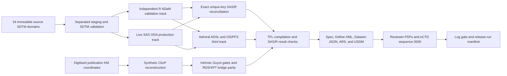

# TROPIC Pipeline Audit Closure

- **Closure date:** 2026-08-10
- **Repository:** `/Users/apple/Desktop/TROPIC`
- **Branch:** `codex/pipeline-audit-closure-2026-08-05`
- **Base HEAD:** `f704b7a721b5c0723e7356addfada7b3cd44ad67`
- **Study:** TROPIC / EFC6193 / XRP6258 / NCT00417079
- **Audit baseline:** `TROPIC_END_TO_END_CONTEXT_AUDIT.md` (same run-record directory)
- **Execution evidence:** live SAS ODA plus independent local R validation

## 1. Final decision

### Engineering and portfolio decision

**GO for controlled portfolio/methods review and technical handoff.** The remediated
working tree completes the manifest-defined 37-stage pipeline with live SAS ODA,
independent R and admiral derivations, exact governed-key reconciliation, generated
TLFs, metadata conformance, reviewer-package checks, eCTD materialization, log
cleanliness, and release-run hash binding.

### Regulatory-submission decision

**NO-GO for an actual sponsor or health-authority submission.** The technical repairs
do not create missing original cabazitaxel patient-level data, sponsor approval,
independent organizational QC, a validated Part 11 operating environment, commercial
Pinnacle 21 certification, signed analysis-plan approval, or medical/statistical
adjudication. The CbzP arm remains reconstructed/synthetic and is not confirmatory
clinical evidence.

> **External-validation addendum — 2026-08-12.** Pinnacle 21 Community 4.1.0 /
> FDA 2508.1 subsequently processed the final seven ADaM datasets (121,320 records;
> zero rejects). Thirty issue groups / 2,373 occurrences remain open and the report
> retains an incompatible-CLI caveat. This improves issue-discovery evidence but is
> not certification, licensed Enterprise clearance, or independent approval; the
> regulated-use NO-GO is unchanged.

### Git/release-governance decision

**REMEDIATION until review, commit, and tag.** The repository was already materially
dirty and the audit repairs are intentionally left uncommitted. Pipeline health is
GREEN, but `scripts/verify_release.py` correctly withholds a release-candidate PASS
because the material worktree is not clean. No staging, commit, tag, push, or pull
request was performed as part of this closure.

## 2. Current evidence snapshot

| Control | Current evidence |
|---|---|
| Pipeline | `GREEN`, `oda`, `full_dag`, 37/37 PASS, zero not-run stages |
| Runtime | SAS `9.04.01M8P022223`; R `4.6.0` |
| Source binding | 34 resident ODA SDTM inputs; manifest SHA-256 prefix `329430f6361e`; nonce probe passed |
| Direct dataset reconciliation | PASS, not simulated, eight domains, exact keyed comparison |
| Endpoint control | `F042_PAIN_RESPONSE=PASS`, 43 records / 43 subjects |
| Admiral third engine | ADSL, ADTTE.OS, and ADTTE.PFS: zero cell differences |
| Numerical results | Six MP time-to-event parameters PASS (SAS `PROC LIFETEST` vs R `survfit`) |
| Forest/figure data | 13 subgroup HRs PASS; KM/risk/waterfall/swimmer/exposure-response data PASS |
| Metadata | 7 datasets / 161 variables; spec→Define PASS; spec→data PASS; 522 Define checks PASS; XSD valid |
| Controlled terminology | 0 CDISC CT violations; two numeric sponsor codelists explicitly dispositioned |
| Log cleanliness | PASS; 13 logs; 0 unapproved findings; 1 exact capped reviewed exception |
| eCTD sequence | PASS; DTD validation executed; 100 files; 92 present/checksummed leaves; 0 missing or unexpected |
| Automated tests | 127 Python tests PASS; all six R test programs PASS |
| SAS lint | 17 programs; 0 blocking errors; 0 advisory warnings |
| ADaM workbook | Authoritative and deliverable copies have identical SHA-256 `e2b95312...a9e7` |

## 3. End-to-end implemented lineage



The reconstructed comparator stages are now explicit stages 14–16, before SAS
production. A clean run therefore cannot silently consume stale ignored RDS/XPT
comparator files.

## 4. Remediation closure by layer

### 4.1 Source, staging, and provenance

- Separated writable staging from `01_source_data/real_sdtm`; source and staging
  paths can no longer resolve to the same physical directory.
- Added SAS and R fail-fast guards for path aliasing and source mutation.
- Added source/staging isolation regression tests and ignore rules for generated
  staging files.
- Bound ODA execution to a manifest-checked resident 34-domain source library.
- Added synthetic reconstruction, intrinsic validation, and export as pre-SAS DAG
  stages; added RDS/XPT bridge parity before TFL generation.

### 4.2 ADSL and subject timeline

- Kept planned treatment (`TRT01P/TRT01PN`) sourced from randomized DM while
  deriving actual treatment (`TRT01A/TRT01AN`) from qualifying administered IV EX.
  One source-supported planned/actual discrepancy is preserved and reported.
- Preferred complete `AEDTHDTC` death evidence, with DS-week fallback.
- Expanded last-known-alive evidence across DS, EX, VS, LB, LS, PN, and SV and
  capped it at death.
- Rejected partial/malformed ISO strings instead of allowing permissive date
  parsing to fabricate day precision. The same contract is enforced in R, SAS,
  and admiral paths.
- Retained observed baseline ECOG/PSA/ALP/HGB values without population-constant
  imputation; unavailable albumin and LDH remain missing with blank flags.
- Implemented component-specific 5-of-7 pain baseline logic.

### 4.3 ADEX, ADCM, ADAE, and ADLB

- Restricted ADEX to qualifying primary IV antineoplastic exposure, source
  `EXTRINT` RDI, positive administered-cycle counts, and source cumulative dose.
- Preserved `CMSEQ` and `LBSEQ` source sequence variables and made them part of
  governed unique keys.
- Corrected ADLB `AVALC` to carry `LBSTRESC`, retained source `LBTOXGR`, and avoided
  unvalidated independent re-grading.
- Kept derived ADLB ANC nadir/recovery records distinguishable from source rows.
- Bounded ADAE continuous episodes and retained source TEAE classification.
- Formally dispositioned the 44 source-classified TEAE records whose recorded start
  predates first dose as one exact, owner-assigned, capped log exception.

### 4.4 ADRS and ADTTE

- Separated lesion-derived RECIST `OVRLRESP` from exploratory bone and generic
  clinical-progression signals.
- Corrected confirmed response/BOR logic, intervening-PD handling, and reconstructed
  PSA prior-nadir logic.
- Limited PFS to typed RECIST, reconstructed PSA, governed F-042 pain, and death,
  with earlier new anti-cancer therapy censoring.
- Kept `BSGRESP` and `CLINPROG` out of BOR, ORR, TTUMOR, and PFS.
- Applied parameter-specific time origins: randomization for OS/PFS/TTPSA/TTUMOR/
  TTPAIN and first dose for TTSAE.
- Bounded TTSAE by the earliest of last known alive, 30 days after treatment end,
  and study cutoff.
- Replaced silent duration flooring with hard missing/pre-origin date failures.
- Guarded all-missing PFS event candidates so SAS no longer emits an invalid
  missing-operation note.

### 4.5 Statistical methods and TFLs

- Implemented stratified Cox models and stratified log-rank tests with Efron ties.
- Applied the controlled final alpha of `0.0452` rather than an ungoverned 0.05.
- Rebuilt the efficacy/safety TFL suite and companion SAS evidence.
- Added exact MP numerical reconciliation, subgroup-forest HR reconciliation, and
  figure-driving data reconciliation.
- Added a G07 gate that fails if the analysis-report secondary TTE values diverge
  from the generated `T-11` table.
- Kept all mixed real/synthetic comparative outputs visibly non-confirmatory.

### 4.6 Reconciliation methodology

- Replaced content-sorted/multiset matching with required, unique governed business
  keys in both tracks.
- Added source sequence identifiers where needed and reject duplicate keys before
  value comparison.
- Persist exact dataset/variable discrepancy extracts whenever parity fails.
- Unit-tested equal data, an injected cell difference, and duplicate-key rejection.

Current production shapes are:

| Dataset | Rows | Columns | Governed reconciliation key |
|---|---:|---:|---|
| ADSL | 371 | 42 | `USUBJID` |
| ADEX | 7,820 | 14 | `USUBJID, PARAMCD, AVISIT` |
| ADCM | 24,534 | 16 | `USUBJID, CMSEQ` |
| ADAE | 5,428 | 29 | `USUBJID, AESEQ` |
| ADLB | 78,619 | 28 | `USUBJID, PARAMCD, AVISITN, LBDY, LBSEQ` |
| ADRS | 2,322 | 13 | `USUBJID, PARAMCD, ADT, AVISIT` |
| ADTTE | 2,226 | 19 | `USUBJID, PARAMCD` |
| CLINSITE | 69 | 10 | `STUDYID, SITEID` |

### 4.7 Metadata, reviewer package, and eCTD

- Added `CMSEQ` and `LBSEQ` to the authoritative ADaM specification and Define-XML.
- Bound Define `KeySequence` to the workbook key definitions and added automated
  order/key checks.
- Corrected stale ADRS OIDs and the malformed ADAE AESER identifier.
- Declared both Define documents as non-submission `Other` context.
- Regenerated 161 variable labels for SAS and R from the workbook.
- Verified predecessor, method, origin, codelist, type, length, order, mandatory,
  and data conformance.
- Rebuilt reviewer PDFs, Module 5 payloads, eCTD v3.2.2 index/STF/MD5 surface,
  Dataset-JSON, ARS, and USDM artifacts.
- Updated live reviewer guides from the old 34-stage/multiset model to the current
  37-stage/unique-key model; dated historical records remain unchanged.

## 5. Current analysis outputs and interpretation boundary

### Real MP ADTTE event counts

| Parameter | N | Events | Censored |
|---|---:|---:|---:|
| OS | 371 | 266 | 105 |
| PFS | 371 | 326 | 45 |
| TTPAIN | 371 | 37 | 334 |
| TTPSA | 371 | 265 | 106 |
| TTSAE | 371 | 78 | 293 |
| TTUMOR | 371 | 96 | 275 |

### Mixed real/synthetic demonstration outputs

| Endpoint | Current output | Interpretation |
|---|---|---|
| OS | HR 0.71 (95% CI 0.60–0.85) | Digitised Guyot CbzP vs real MP; compatible diagnostic, not original IPD reproduction |
| PFS | HR 0.87 (0.75–1.02) | Mixed-source diagnostic outside legacy publication-compatibility range |
| TTPSA | HR 0.84 (0.70–0.99), p=0.0319 | PH-scaled synthetic secondary endpoint; circular/non-inferential |
| TTUMOR | HR 0.89 (0.66–1.22), p=0.4406 | PH time-scaled and event-count-constrained synthetic endpoint; circular/non-inferential |
| TTPAIN | HR 2.85 (1.98–4.12), p<0.0001 | PH-scaled synthetic secondary endpoint; circular/non-inferential |
| MP pain response | 43/156 (27.6%) | Real source-qualified PN/SV implementation; no synthetic CbzP pain response is imputed |

The Guyot intrinsic gates pass for the reconstructed CbzP OS/PFS curves. The live
OS compatibility diagnostic passes. The live PFS diagnostic is a disclosed warning
because the corrected real-MP PFS definition is not the same source/endpoint surface
that generated the publication curve. It must not be described as reproducing the
published PFS hazard ratio.

## 6. Verification performed after the production run

The following checks were executed independently after the complete live-SAS DAG:

```text
python3 -m pytest -q
Rscript tests/smoke_test.R
Rscript tests/test_f042_provisional_pain_derivation.R
Rscript tests/test_figure_outputs.R
Rscript tests/test_lab_shift_table.R
Rscript tests/test_tfl_population_contract.R
Rscript tests/test_tfl_stats.R
python3 platform/apply_metadata_lineage.py --check
Rscript 03_metadata/define/check_define_conformance.R
python3 03_metadata/define/validate_define.py
bash 03_metadata/define/validate_xsd.sh
Rscript 04_analysis_datasets/programs/r/spec_data_checks.R
python3 platform/ct_cross_validation.py
python3 platform/build_metadata_control_report.py
python3 platform/validate_ectd_sequence.py --json
python3 platform/cibuild.py --validate-dag
python3 platform/lint_sas.py
git diff --check
```

All technical checks above passed. CDISC CT cross-validation reported zero
violations; its two numeric-only traceability warnings (`CL.TRT01PN`, `CL.CNSR`)
are explicitly classified and justified as sponsor-defined in
`config/metadata_lineage.yaml`, leaving zero unresolved metadata-control findings.

## 7. Remaining blockers and accepted residuals

| Priority | Item | Disposition / close condition |
|---|---|---|
| Blocking | Original CbzP patient-level data are absent | Obtain authorized original IPD; synthetic/reconstructed data cannot close this |
| Blocking | Combined demonstrative N=749 is not original randomized ITT N=755 | Obtain complete original population and reconcile all exclusions |
| Blocking | No sponsor-approved/signed SAP, protocol deviations, adjudication, or accountable approvals | Sponsor-controlled document and approval workflow required |
| Blocking | No independent organizational programmer/statistician/medical QC signoff | Qualified independent review and documented issue closure required |
| Blocking | No validated Part 11 environment/e-signatures/access-control evidence | Execute under a validated regulated platform and SOP/QMS controls |
| Blocking | No licensed, qualified Pinnacle 21 Enterprise clearance; Community findings remain open | Run the final package in licensed, qualified Enterprise and independently approve every finding disposition |
| Governance | Working tree is uncommitted and release verifier remains REMEDIATION | Peer review, intentional commit, clean checkout rerun/readback, tag, and archive |
| Accepted | 44 source-classified TEAE rows predate first dose | Exact capped reviewed exception; count or wording drift fails the log gate |
| Accepted | Source week/partial-date precision limitations | Preserve precision; never fabricate day values; sensitivity review where material |
| Accepted | One planned/actual treatment discrepancy | Retained visibly from DM planned arm and administered EX evidence |
| Accepted | Synthetic PFS compatibility warning | Keep non-confirmatory disclosure; do not claim published PFS reproduction |
| Accepted | Secondary synthetic TTE endpoints are circular | Portfolio mechanics only; never interpret as treatment-effect evidence |

## 8. Submission-readiness matrix

| Question | Answer |
|---|---|
| Can a senior programmer reproduce and inspect the current pipeline? | **Yes** |
| Does the complete manifest DAG execute with real SAS and independent R checks? | **Yes** |
| Are the produced technical artifacts internally coherent under implemented rules? | **Yes** |
| Is the worktree ready to be reviewed and intentionally committed? | **Yes** |
| Is the current dirty worktree a release candidate? | **No** |
| Is this a complete original TROPIC two-arm IPD reproduction? | **No** |
| Is it ready for sponsor/health-authority filing? | **No** |

## 9. Controlled next handoff

1. Review this remediation diff and the preserved forensic baseline.
2. Obtain independent statistical, medical, standards, and programming review.
3. Resolve or formally accept every remaining finding under a real QMS.
4. Commit intentionally on a clean branch; rerun the 37-stage live-SAS DAG from the
   clean commit; verify `scripts/verify_release.py` reaches full PASS.
5. Reproduce the final package in licensed, qualified Pinnacle 21 Enterprise, independently approve every finding disposition, and archive the unaltered report in the qualified system.
6. Tag and archive only after release authority signs the final package.

## CONTEXT FOR NEXT MODEL

- The historical baseline report is preserved and explicitly marked superseded.
- The current technical pipeline is 37 stages, not 34.
- Source/staging separation, strict complete-date parsing, typed endpoint inputs,
  source sequence keys, metadata keys, exact reconciliation, and log controls are
  implemented and tested.
- Current pipeline health is GREEN with real ODA SAS; direct, admiral, results,
  forest, and figure reconciliation all pass.
- The current authoritative ADaM workbook is
  `03_metadata/adam/ADaM_spec.xlsx`; the delivery copy is under
  `06_qc_evidence/audit/run_records/2026-08-09-pipeline-audit/ADaM_spec.xlsx`
  and has the same SHA-256.
- Do not report the synthetic CbzP arm as real trial IPD or the mixed-source PFS
  comparison as publication reproduction.
- Do not claim regulatory submission readiness. The technical portfolio is ready
  for review; regulated submission remains externally blocked.
- Do not stage, commit, tag, push, or create a PR without explicit authorization.
