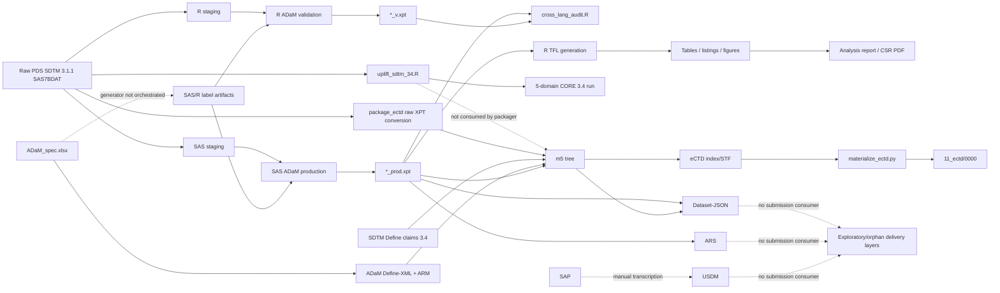

# TROPIC Clinical Programming Pipeline — End-to-End Audit

**Audit date:** 25 June 2026
**Repository:** `/Users/apple/Desktop/TROPIC`
**Auditor role:** independent clinical data programming audit
**Evidence commit at audit start:** `90d7403` (`style(ci): satisfy zero-warning R lint gate`)
**Scope:** FDA-oriented eCTD sequence plus SDTM, ADaM, Define-XML, ARM, CT, Dataset-JSON, ARS, USDM, SAS/R production and QC, TLFs, documentation, logs, CI, and runtime/vendor material.

## 1. Executive summary

**Verdict: NOT SUBMISSION-READY.** The repository is a technically ambitious demonstration, but it is not a defensible regulatory submission pipeline in its present state. Five Critical and nineteen Major findings remain. The blockers are not cosmetic: the current eCTD sequence mixes a data-free preview index with 44 stale, unindexed patient-level XPT payloads; the packaged SDTM files are source-era SDTM 3.1.1 structures while the Define-XML and SDRG claim SDTMIG 3.4; and the real analysis data contain only the 371-subject mitoxantrone arm while the comparative TFLs add a reconstructed/simulated 378-subject cabazitaxel arm. Those outputs cannot support a regulatory treatment comparison for the original randomized trial.

The QC evidence also cannot be relied upon as currently represented. The R ADEX derivation writes literal `"NA"` into `AVALC` for 1,746 records; the reconciliation code converts that text to missing and reports zero differences. All eight current SAS production XPT hashes differ from both the durable evidence manifest and the stale eCTD copies. The claimed provenance guard tests only that SAS and R files are byte-distinct and explicitly permits a vacuous pass when artifacts are absent. Current ADaM files also fail the repository's own label check for five variables, despite a tracked PASS status.

Submission outputs are incomplete or internally inconsistent. The SAP specifies 31 TFLs, but 21 are absent and nine produced outputs have no SAP catalog entry. The discontinuation listing is a fabricated seven-record placeholder citing a nonexistent program. The MP laboratory-shift table contains 458/457/457 counted records against an `n=371` denominator. The PSA response analysis uses the full ITT denominator rather than the prespecified baseline-PSA eligible population. The SAP is unapproved and contradicts the ADRG/reproducibility documentation on the comparator reconstruction and OCCDS version.

Positive controls are real but narrower than the readiness claims: both Define files are XML/XSD and internal-reference valid; all 43 Dataset-JSON files pass the bundled schema; ADSL has exactly one row per subject; the latest ADaM CT cross-check finds no violations among two CDISC-linked and five sponsor-defined codelists; the eCTD backbone XML/DTDs and indexed checksums validate; and the R smoke/figure tests and seven sponsor ADaM CORE rules pass. These controls do not cover the final delivered package or resolve the defects above. A full current Pinnacle 21/FDA profile has not been run; PMDA validation-rule v6.0 and EMA-specific dossier readiness are **UNVERIFIED**.

Top remediation priority is to freeze one authoritative full-data build, bind every artifact to one run/commit, package only the final SDTM 3.4/ADaM outputs, rerun exact independent SAS/R comparisons, correct the analyses/TFLs, complete Define/ARM traceability, and then execute current regulator-specific validation on the exact sequence intended for submission.

## 2. Audit basis and method

### 2.1 Current external baseline

- FDA: [Study Data Technical Conformance Guide, June 2026](https://www.fda.gov/media/153632/download), especially §8.1.2: evaluate against SDO conformance rules, eCTD technical rejection criteria, and FDA Business Rules; correct or explain meaningful discrepancies in reviewer guides.
- FDA: [Study Data Standards Resources](https://www.fda.gov/industry/fda-data-standards-advisory-board/study-data-standards-resources). FDA still describes Dataset-JSON as an evaluation/pilot replacement candidate; XPT v5 remains the supported exchange path.
- FDA: [Data Standards Catalog, March 2025](https://www.fda.gov/regulatory-information/search-fda-guidance-documents/data-standards-catalog).
- CDISC: [Define-XML v2.1](https://www.cdisc.org/standards/foundational/define-xml/define-xml-v2-1-0) and [Controlled Terminology release 2026-03-27](https://www.cdisc.org/standards/terminology/controlled-terminology).
- CDISC CORE: the [May 2026 status](https://www.cdisc.org/zh-hans/node/7881) still describes CORE v1.0 as targeted for mid-2026; the repository's bundled v0.16.0 does not provide a comprehensive executable ADaM pack.
- ICH: [E9(R1), final Step 4](https://database.ich.org/sites/default/files/E9-R1_Step4_Guideline_2019_1203.pdf), including explicit estimands, aligned estimators, sensitivity analyses, and documentation in A.2–A.6.
- Electronic records: [21 CFR Part 11](https://www.ecfr.gov/current/title-21/chapter-I/subchapter-A/part-11), including validation, access, audit-trail, authority, change-control and signature requirements in §§11.10, 11.50, 11.70 and Subpart C.
- PMDA: [New Drug Review with Electronic Data](https://www.pmda.go.jp/english/review-services/reviews/0002.html); current gateway validation uses PMDA validation-rule v6.0 / Pinnacle 21 Enterprise engine PMDA 2411.1. This repository has no such final-package run.
- EMA: [clinical study data proof-of-concept](https://www.ema.europa.eu/en/about-us/how-we-work/data-regulation-big-data-other-sources/use-clinical-study-data-medicine-evaluation); the pilot requests SDTM, ADaM, Define-XML and optionally ARM. No EMA-specific submission package was supplied here.

### 2.2 Coverage and inspection

The frozen pre-audit snapshot excludes only the repository's administrative root `.git/` and the auditor-created `audit/` directory. The nested CORE-engine checkout, its `.git`, all environments, ignored local files, runtime caches, datasets and outputs are included.

| Measure | Result |
|---|---:|
| Filesystem entries inventoried | 18,377 |
| Regular files | 18,374 |
| Symlinks followed and hashed | 3 |
| Bytes read | 2,561,874,812 |
| Entries with `visited=YES` | 18,377 |
| Distinct SHA-256 values | 14,773 |
| Clinical/repository entries excluding third-party runtime | 648 |
| Third-party/runtime entries | 17,729 |

Every entry was opened and read in full for SHA-256, size and signature classification. Clinical source/text was decoded and statically inspected. The 33-page SAP was structurally read and rendered page-by-page; all 13 unique TFL figures were visually inspected. All 15 PDFs were hashed, duplicate-grouped and fully text-extracted; the 525-page CRF and 108-page protocol were sampled visually after full extraction. The 10-sheet ADaM workbook was read cell-by-cell; visual workbook rendering is **UNVERIFIED** because the bundled artifact renderer failed macOS code-signature validation, so OOXML structure plus `readxl`/`openpyxl` inspection was used. All 147 SAS/XPORT datasets were metadata-read; clinical source/output datasets received first/last five-record readability checks without reproducing subject values. All 56 inventoried RDS files were fully deserialized. All 43 Dataset-JSON files were validated against the bundled schema.

The complete immutable ledger is [file_inventory.csv](file_inventory.csv), with category, purpose, inputs/outputs, dependencies/consumers, SHA-256 and audit method for every entry. Structural dataset evidence is in [dataset_metadata.csv](dataset_metadata.csv) and [rds_metadata.csv](rds_metadata.csv).

## 3. Phase 1 — inventory and dependency graph

### 3.1 Classification

| Classification | Files | Bytes |
|---|---:|---:|
| Raw/source | 76 | 219,356,734 |
| Spec/metadata | 46 | 566,693 |
| SDTM/ADaM/macro programs | 18 | 255,832 |
| TLF programs | 2 | 57,838 |
| Validation/QC | 37 | 246,674 |
| Config | 56 | 97,636,086 |
| Documentation | 36 | 383,684 |
| Outputs | 305 | 458,464,166 |
| CI/orchestration | 72 | 805,973 |
| Third-party/runtime | 17,729 | 1,784,101,132 |

### 3.2 Directed graph

The complete 57-edge adjacency list, including broken and absent edges, is [dependency_edges.csv](dependency_edges.csv).

### 3.3 Orphans, dangling references and dead/unorchestrated code

The explicit 63-row register is [orphans_dangling_deadcode.csv](orphans_dangling_deadcode.csv). It contains every confirmed item found:

- 44 individually named unindexed XPT files under `11_ectd/0000/m5/` (eight ADaM/BIMO and 35 SDTM copies, with one BIMO duplicate path).
- One dangling producer reference: `L_discon.sas` does not exist.
- Two confirmed unused historical/developer programs: `GIT_RESCUE.sas` and `remediate_sdtm_define.py`.
- Four QC/generator programs not invoked by the release DAG: `gen_adam_labels.R`, the two admiral derivations, `admiral_reconcile.R`, and `figure_data_reconcile.R`.
- Three documented but out-of-DAG reconstruction/bridge prerequisites.
- One documented one-time specification migration program.
- Dataset-JSON, ARS and USDM as delivery orphans: produced by pipeline stages but not consumed by `package_ectd.py` or indexed in the sequence.
- Dataset-NDJSON as an out-of-band stale output family; `TA` has JSON but no NDJSON.
- 21 specified-but-not-produced TFL IDs, nine produced-but-not-specified TFL IDs, and 17 produced-but-not-defined SDTM datasets.

No third-party/runtime component was labeled an orphan merely because no clinical program references it directly; those files are dependencies of the bundled runtime or its test suite.

## 4. Phase 2 — traceability validation

### 4.1 ADaM dataset and variable traceability

The exhaustive 159-row matrix is [adam_variable_traceability.csv](adam_variable_traceability.csv). For each variable it records origin, predecessor, MethodOID/description, SAS producer, R producer, physical XPT presence, Define presence and forward TFL consumers.

Results:

- All 159 specified ADaM variables exist physically and in Define.
- All 159 have a blank workbook `Predecessor`; therefore no variable has a complete documented SDTM `dataset.variable` source chain.
- 39 variables are marked Derived; 29 of those have no MethodOID/algorithm.
- The workbook's Documents sheet is empty, so methods cannot resolve to a controlled SAP/program document and page/section.
- Dataset-level source descriptions exist in the traceability guide, but they do not satisfy variable-level predecessor traceability.
- `CLINSITE` is physically produced and used for BIMO but is outside the ADaM Define; this is acceptable only if its separate BIMO data definition is delivered and validated as such.

### 4.2 Define-XML versus data

Detailed results are in [metadata_data_drift.csv](metadata_data_drift.csv).

**ADaM:** ADEX and ADRS variable order matches Define. ADAE, ADCM, ADLB, ADSL and ADTTE do not. Five current labels are absent (`ADCM.ASTDT/AENDT/ASTDY`, `ADEX.PARAMN/AVISITN`). The label macro still names pre-rename `CMSTDT/CMENDT/CMSTDY` variables; the SAS log confirms those variables are uninitialized.

**SDTM:** the sequence contains 35 XPTs while Define describes 18. The 17 produced-but-not-defined domains are `CD, CX, EG, IE, MH, PE, PR, SC, SUPPEG, SUPPIE, SUPPMH, SUPPPE, SUPPPR, SV, TE, TI, TV`. Major variable drift includes:

- DM missing `AGE, ACTARMCD, ACTARM`; extra `AGEGRP`.
- AE missing `AESOC, EPOCH`; extra week variables and `SUBJID`.
- EX missing `EPOCH, EXENDY`; extra `SUBJID`.
- CM missing ten defined variables.
- LB missing `LBOVISIT`; LS missing `LSSLOC`; VS missing `EPOCH`.
- Several SUPP datasets contain `SUBJID` not declared in Define.

Both Define documents are well-formed, XSD-valid and pass the repository's internal OID/WhereClause checks. That proves document structure, not agreement with the delivered datasets.

### 4.3 ARM

OIDs, WhereClause references and ItemGroup/Item references resolve structurally. Ten WhereClauses exist; seven serve value-level metadata and additional clauses serve ARM parameters. The substantive gaps are:

- Survival ARM code uses `ECOGBL` and `MEASDISF`, but the analysis declares only ADTTE; those covariates are ADSL variables.
- ResultDisplay names mention TFL IDs but do not resolve to actual table/figure document leaves.
- Eight displays/ten analyses do not cover the complete SAP analysis/output catalog.
- The ARM claims `PRE-SPECIFIED IN SAP` for code whose actual population/data include reconstructed synthetic comparator data not represented in the reconciled ADaM.

### 4.4 Controlled terminology

The current `ct_cross_validation.json` uses the 2026-03-27 offline cache and passes the seven ADaM codelists: two are high-confidence NCI-linked (`NY`, `SEX`) and five are sponsor-defined. The physical values checked by the local ADaM conformance program conform to their referenced workbook codelists. Limits:

- This is not a full FDA/PMDA CT validation of every SDTM/ADaM variable and external dictionary.
- The USDM builder hardcodes CT 2024-03-29, contradicting the release baseline.
- Final full-package CT validation in current Pinnacle 21/FDA/PMDA profiles is **UNVERIFIED**.

### 4.5 Dual programming

All eight SAS/R pairs have the same row count and variable set. After column alignment, seven pairs are record-concordant under the current comparison conventions. ADEX has 1,746 real `AVALC` differences (`blank` in SAS versus literal `"NA"` in R). The production reconciliation hides them by normalizing both empty and `"NA"` to missing. The current PASS is therefore invalid. The independent full-record evidence is [dual_language_comparison.csv](dual_language_comparison.csv).

The declared keys are nonunique for ADCM (15,169 records implicated), ADLB (1,497) and ADRS (737). The multiset implementation can compare repeated records, but it weakens row-level explainability and should be supplemented with stable record identifiers where the model permits. The third admiral track is standalone and not run by the release DAG.

### 4.6 SAP/estimand/TFL alignment

The SAP defines estimand attributes and hierarchical testing, but implementation/document control is incomplete:

- The PSA response program does not apply the baseline-PSA eligible population.
- The combined TFL ITT is 749, not the trial ITT N=755.
- The comparator reconstruction is described inconsistently as Guyot versus PH scaling; secondary endpoints are explicitly PH-scaled/circular.
- The SAP catalog and produced outputs do not reconcile.
- SAP Tables 23-24 have placeholder names/dates and no approvals.

TFL catalog reconciliation:

- **Specified, not produced (21):** `F-12-2`; `T-11-1`–`T-11-5`; `T-12-1/2`; `T-13-1/2/3`; `T-14-1`–`T-14-6`; `T-15-1`; `T-16-1/2`; `T-17-3`.
- **Produced, not specified (9):** `F-01-1`, `F-13-1`, `F-14-1`, `L-01-1`, `T-11-8b`, `T-20-1/2`, `T-21-1/2`.

## 5. Phase 3 — conformance and regulatory controls

### 5.1 SDTM/ADaM structural checks

- ADSL: 371 rows and 371 unique `USUBJID`; one-record-per-subject passes for the available MP subset.
- SDTM `--SEQ`: no missing/duplicate sequence was found in subject domains checked; TSSEQ is nonunique by TSPARMCD.
- ISO 8601: confirmed invalid/dirty values occur in `CMSTDTC`, `CXDTC`, `LBDTC`, `LSDTC` and `PNDTC` (for example incomplete separators and non-zero-padded components).
- BDS/OCCDS: basic row structures and parameter variables exist, but parameter-level metadata is incomplete and multiple declared business keys are nonunique.
- The repository's current ADaM label check, rerun on a temporary mirror to avoid repository mutation, fails five AD0102 findings. The tracked `adam_conformance_status.json` PASS is stale.

### 5.2 CORE/Pinnacle 21-style validation

The authoritative local SDTM 3.4 CORE report covers only DM/AE/EX/DS/VS. It records 20 issue groups and 13,010 occurrences:

- `CORE-000022` (1) and `CORE-000266` (1,136): AE seriousness inconsistency.
- `CORE-000334` (four dataset findings): expected variable missing.
- `CORE-000355` (DM): required variable missing.
- `CORE-000732` (3,588): nonnumeric VSSTRESC while VSSTRESN is populated.
- `CORE-000767` (8,270): FAOBJ/parent relationship issue.
- `CORE-000929` and `CORE-001081` (ten engine evaluation errors).

The run record's assertion that none are programming defects is not accepted: required/expected-variable and semantic safety/VS findings remain submission-relevant even when inherited from a de-identified source. The other 30 delivered SDTM datasets were not tested in that authoritative run.

The bundled CORE has no comprehensive published executable ADaM pack. Seven sponsor rules pass but do not substitute for the current ADaM conformance rules. A current full Pinnacle 21/FDA Validator run is **UNVERIFIED**. For PMDA, validation-rule v6.0 / engine PMDA 2411.1 is **UNVERIFIED**.

### 5.3 Define-XML / Dataset-JSON / ARS / USDM

- Define-XML 2.1: both documents are XSD-valid and internally referentially valid; substantive data drift fails readiness.
- Dataset-JSON: all 43 JSON documents pass the bundled schema. ADCM omits `ASTDT` from keySequence because the exporter names nonexistent `CMSTDT`; most SDTM datasets have no keySequence despite the comment promising dynamic `--SEQ`; MDV says SDTM 3.1.1. The current data-free `m5` contains no SDTM XPTs, and the exporter can return success for zero SDTM inputs. There are 42 NDJSON files; TA is missing.
- ARS: only OS, PFS, TTPSA and TTUMOR are modeled. Official complete schema/profile validation and document-location resolution are **UNVERIFIED**.
- USDM: UUIDv4 makes every build byte-different; CT is stale; official schema/version conformance is **UNVERIFIED**.

### 5.4 eCTD

The index, US regional XML and STF are DTD-valid; all indexed hrefs resolve and their recorded MD5 checksums match. `index-md5.txt` matches `index.xml`. Those passes apply only to the 48 indexed preview leaves. They do not detect the 44 unindexed XPT payloads left from an earlier full build. The US regional file labels itself an example and uses application `000000`; the blank CRF is a one-page placeholder. This sequence must not be submitted.

### 5.5 Reproducibility, logs and Part 11

- Git provenance exists and the worktree was clean before auditor outputs were added.
- Current production outputs are not bound to the committed ODA evidence manifest; all eight hashes differ ([output_hash_binding.csv](output_hash_binding.csv)).
- USDM identifiers and timestamps in several generated JSON/status artifacts are nondeterministic.
- SAS log: invalid INPUT note, 39 event/censor-date flooring warnings, and three uninitialized variables. R ADEX log: coercion warning. The final SAS log nevertheless claims zero errors.
- Credential-bearing local files are present but gitignored. Their contents were not reproduced in this audit.
- No evidence establishes system validation, role-based access, secure independent audit trails, authority checks, training controls, electronic-signature identity, or signature/record linking. Therefore 21 CFR Part 11 compliance is **UNVERIFIED**, not passed.

## 6. Findings register

The complete register—with severity, confirmed-versus-unverified status, file/line evidence, rule/standard, concrete remediation and effort—is [findings_register.csv](findings_register.csv).

| ID | Severity | Short title |
|---|---|---|
| F-001 | Critical | Mixed preview/full eCTD with 44 unindexed XPTs |
| F-002 | Critical | SDTM 3.1.1 payload represented as SDTMIG 3.4 |
| F-003 | Critical | Synthetic comparator cannot support submission inference |
| F-004 | Critical | Fabricated discontinuation listing / nonexistent program |
| F-005 | Critical | Example application metadata and placeholder CRF |
| F-006 | Major | Inflated laboratory-shift counts |
| F-007 | Major | ADEX SAS/R divergence hidden by normalization |
| F-008 | Major | ADaM labels/order drift |
| F-009 | Major | Evidence hashes not bound to current outputs |
| F-010–F-014 | Major | SAP/TFL, population, variable and ARM traceability gaps |
| F-015–F-018 | Major | Partial conformance, unverified ADaM validation, dirty dates, log defects |
| F-019–F-023 | Major | Document, Dataset-JSON, USDM, ARS and trace-matrix defects |
| F-024 | Minor | Explicit dead/orphan artifact cleanup |
| F-025 | Major | Part 11 control evidence absent |

## 7. Prioritized remediation plan

| Priority | Actions | Effort | Exit criterion |
|---:|---|---|---|
| 1 | Quarantine the current sequence; remove fabricated/placeholder content; decide whether this is a regulatory submission or demonstration. | 1–3 days + governance | No submission use until Critical scope is resolved. |
| 2 | Obtain/authorize complete two-arm source data; retire synthetic comparative inference for submission. | XL | Final populations reconcile to protocol/SAP and actual randomized subjects. |
| 3 | Establish one immutable release run: commit/environment/input/program/output/log/QC hashes, atomic staging, signed approval. | 2–3 weeks | Every claimed status cryptographically binds to the exact final artifacts. |
| 4 | Package only the uplifted SDTMIG 3.4 layer; complete Define for all delivered domains/variables; fix dates, timing, required variables and safety/VS semantics. | 2–4 weeks | Full final-package SDTM/Define CORE + P21/FDA profile dispositioned. |
| 5 | Regenerate labels and ADaM from the authoritative spec; fill all 159 predecessors and all derived methods; correct ARM dataset/variable/file links. | 2–3 weeks | Spec = Define = physical XPT order/type/length/label/CT; traceability has no gaps. |
| 6 | Fix ADEX and use exact, non-lossy SAS/R comparison; integrate admiral and figure-data QC or remove claims. | 1 week | All dual-language differences are zero or approved and explained. |
| 7 | Correct lab shifts, PSA population, ITT counts and TFL catalog; implement missing outputs and independent arithmetic/statistical QC. | 2–4 weeks | Approved SAP ↔ programs ↔ datasets ↔ outputs is bijective. |
| 8 | Reconcile/approve SAP, ADRG, SDRG and reproducibility documents; obtain valid approvals/e-signatures in a governed system. | 1–2 weeks + sponsor approval | One consistent approved document set. |
| 9 | Rebuild eCTD atomically with real application metadata, annotated CRF, final data and no unindexed file; run FDA eCTD rejection validation. | 1 week | Zero missing, stale or unindexed leaf; final sequence checksum manifest passes. |
| 10 | Run current regulator-specific validation: FDA P21/Validator, PMDA v6.0 if targeted, and EMA-specific checks if targeted. | 3–7 days each | Complete reports retained and every issue corrected or justified. |
| 11 | Either govern Dataset-JSON/ARS/USDM as validated outputs or remove them from readiness claims. | 1–2 weeks | Deterministic, schema-valid, traceable outputs with explicit consumers. |

## 8. Coverage checklist

- [x] Frozen snapshot enumerated recursively, excluding only root `.git/` administration and auditor-created `audit/`.
- [x] 18,377/18,377 entries opened, byte-read, hashed, classified and assigned a purpose/dependency role.
- [x] 147/147 SAS/XPORT datasets metadata-read; one intentionally empty CORE test fixture is unreadable and recorded as such.
- [x] 56/56 inventoried RDS files fully deserialized.
- [x] 15/15 PDFs fully text-extracted; duplicate copies reconciled; large source documents visually sampled.
- [x] 1/1 DOCX read and all 33 pages rendered/inspected.
- [x] 14/14 XLSX files byte-read; clinical ADaM workbook fully read across all ten sheets; visual workbook rendering remains explicitly UNVERIFIED.
- [x] 43/43 Dataset-JSON files schema-validated; 42 NDJSON files structurally accounted for.
- [x] 13/13 unique clinical TFL figures visually inspected.
- [x] 159/159 ADaM variables represented in the variable traceability ledger.
- [x] 43/43 delivered ADaM/SDTM datasets represented in the Define/data drift comparison.
- [x] 63/63 identified orphan/dangling/dead/unorchestrated items explicitly registered.
- [x] 25/25 findings include evidence, severity, standard/rule, remediation and effort.

**Coverage reconciliation:** files inventoried **18,377**; files audited **18,377**; difference **0**. The audit scripts and outputs were created after the frozen snapshot and are therefore not recursively added to their own inventory.
